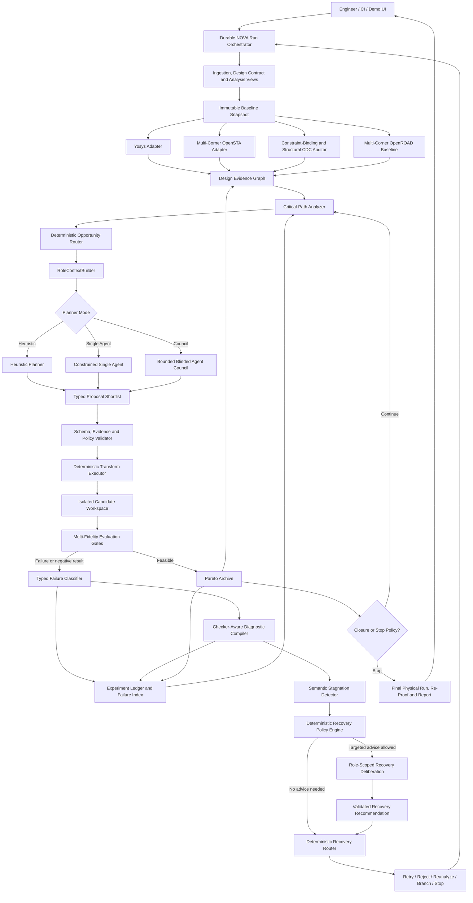

# NOVA-RTL: Integrated Constrained, Multi-Agent, Failure-Aware RTL Optimizer

**Document type:** Final unified end-to-end architecture and design specification  
**Status:** Architecture signed off for implementation  
**Date:** 2026-08-08  
**Last amended and reviewed:** 2026-08-14  
**Challenge:** Constraint Optimization through RTL Enhancement Using Generative AI  
**Primary tools:** SystemVerilog, Python, Yosys, OpenSTA, OpenROAD, EQY, SymbiYosys  
**Reasoning modes:** Heuristic, constrained single-agent, bounded multi-agent council  
**Recovery model:** Deterministic failure classification and routing with selective agent assistance

---

## 1. Document Authority and Scope

This specification is the authoritative integrated architecture for NOVA-RTL. It consolidates the original constrained neuro-symbolic optimizer and bounded multi-agent council designs into one implementation authority. Earlier design iterations are intentionally omitted from this final repository; if another document conflicts with this architecture, this document governs.

The architecture also incorporates the strongest transferable ideas from the NetGen failure-aware analog-netlist workflow:

- classify failures before deciding how to retry;
- translate raw checker output into domain-specific repair guidance;
- distinguish local repair from architecture-level redesign;
- assign failure-family-specific retry budgets;
- detect repeated structurally similar failures; and
- escalate deliberately instead of spending retries on cosmetic variations.

Those ideas are adapted rather than copied. NOVA-RTL does not generate arbitrary replacement RTL, does not use textual similarity as its primary stagnation signal, does not let agents execute EDA tools, and does not replace its candidate DAG, formal gates, immutable constraints, or Pareto search with a linear generate–repair loop.

---

## 2. Executive Summary

NOVA-RTL—**Neuro-symbolic Optimization and Verification Architecture for RTL**—is a closed-loop system that:

1. ingests a multi-clock RTL design and immutable timing contract;
2. builds a normalized evidence graph from synthesis, timing, physical, clock, reset, and CDC data;
3. identifies critical path clusters and classifies their likely root causes;
4. uses either deterministic heuristics, one constrained agent, or a bounded multi-agent council to propose typed transformations;
5. applies only registered transformations through a deterministic executor;
6. evaluates each isolated candidate through progressively more expensive safety, formal, multi-corner timing, and physical gates;
7. converts failed tool outcomes into typed, checker-aware recovery directives;
8. detects repeated non-progress and routes the next action through a bounded escalation policy;
9. retains feasible alternatives on a measured timing/area/power Pareto frontier; and
10. exports optimized RTL, proof results, PPA reports, and a replayable audit bundle.

The system has one governing invariant:

> Generative AI may influence which safe experiment is attempted next. Only deterministic policy, formal verification, and measured EDA results determine whether the experiment is accepted.

This produces an optimizer that is both ambitious and credible. Its novelty is not merely that several agents discuss RTL. Its novelty is the integration of:

- evidence-grounded multi-agent hypothesis generation;
- role-scoped and blinded reasoning;
- deterministic source transformation;
- transformation-specific formal correctness;
- multi-view, multi-fidelity PPA measurement;
- failure-semantic adaptive recovery;
- candidate-stagnation detection; and
- auditable multiobjective search.

For an evaluator, the central story is simple:

> NOVA-RTL does not ask judges to trust an AI-generated patch. It shows why a path is slow, why a bounded change is legal, how independent specialists challenged it, what the tools measured, what formal proved, why failed attempts were abandoned or repaired, and how the surviving candidate compares with the original under the same constraints.

---

## 3. Challenge Interpretation and Binding Assumptions

### 3.1 Required capabilities

The delivered framework must:

- analyze Verilog/SystemVerilog RTL against specified timing constraints;
- identify critical paths and timing violations across all relevant domains;
- use generative AI to recommend logic restructuring, retiming, pipelining, and FSM/state-machine optimization;
- preserve protected clock, reset, and CDC structures;
- measure setup and hold across declared analysis views, frequency, area, and a defensible power estimate under one versioned activity contract;
- formally verify the applicable relationship between original and optimized RTL;
- produce an optimized RTL snapshot and exact patch;
- retain successful and failed experiments;
- generate timing, PPA, formal, CDC, and audit reports; and
- expose the complete workflow through an interactive live/replay demo.

### 3.2 Benchmark interpretation

Until the organizers clarify the phrase “21 21 generated clock per master,” the benchmark uses the stricter interpretation:

- five mutually asynchronous master clock domains;
- twenty-one generated clocks per master;
- one hundred and five generated clocks total;
- generated clocks synchronous only to their own master lineage;
- multiple divider ratios, including odd and even ratios;
- approved CDC structures between selected domains; and
- a mapped size target of 45,000–55,000 standard cells.

The generator parameterizes these values so a clarified requirement changes configuration, not architecture.

### 3.3 PSM interpretation

“PSM optimization” is treated as FSM/state-machine optimization. The default registry exposes `FSM_REENCODE` and `FSM_DECODE_RESTRUCTURE`. OpenROAD static IR-drop analysis may be added as physical evidence, but it is not confused with an RTL state-machine transformation.

### 3.4 Reproducibility assumptions

- Baseline and candidates use identical libraries, constraints, flow recipes, physical settings, and seeds unless a seed-sensitivity experiment is explicitly labeled.
- Tool versions, model identifiers, prompts, schemas, commands, environment fingerprints, and artifact hashes are recorded.
- The implementation uses a pinned container or reproducible toolchain installation.
- Timing and physical comparisons use the same required analysis views, Liberty/RC corners, SDC, operating conditions, derates, and activity contract.
- Formal, synthesis, and timing analyze the same functional RTL and parameterization; formal-only files or defines may add properties and legal environment assumptions but may not alter design behavior.
- Missing tools or broken baseline harnesses stop the run before optimization.
- Closed-model results are labeled with provider and service-version limitations.

---

## 4. Goals, Non-Goals, and Success Criteria

### 4.1 Goals

1. **Correctness first:** no timing gain compensates for a failed or inconclusive mandatory proof.
2. **Constraint integrity:** timing closure cannot be manufactured by weakening the SDC or hiding endpoints.
3. **Path-local intelligence:** agents receive compact evidence relevant to one opportunity or failure.
4. **Diverse but bounded reasoning:** independent specialists and critics improve hypotheses without controlling the flow.
5. **Deterministic execution:** only whitelisted, preconditioned transformations modify RTL.
6. **Adaptive recovery:** failed candidates generate typed evidence and a deliberate next action.
7. **Efficient exploration:** cheap gates and failure-aware routing protect formal and OpenROAD budgets.
8. **Measured multiobjective value:** the system exposes timing, area, power, change size, and proof cost trade-offs.
9. **Explainability:** every material claim cites a stored evidence object.
10. **Practical utility:** CLI, API, replay, CI integration, and engineer review are first-class.
11. **Reproducibility:** every selected result can be reconstructed from immutable inputs and manifests.
12. **Compelling demonstration:** failures, disagreements, proofs, recovery decisions, and final improvements are visible.

### 4.2 Non-goals

- Replacing synthesis, STA, physical implementation, CDC analysis, or formal tools with LLM judgment.
- Giving agents unrestricted repository, shell, filesystem-write, SDC-write, or tool-execution access.
- Automatically changing clock dividers, synchronizers, reset synchronizers, or black-box IP.
- Calling an LLM disagreement a proof.
- Claiming strict equivalence for latency-changing pipeline insertion.
- Regenerating the entire 50K-cell design after a local failure.
- Running all agents for every path or every failure.
- Creating recursive, self-replicating, or unbounded agent workflows.
- Optimizing a report number without verifying constraint and artifact provenance.
- Treating a hosted model, network connection, or agent framework as required for the demo to complete.

### 4.3 Technical success criteria

A complete run must show that:

- every expected master and generated clock is present with valid lineage;
- every required setup, hold, and physical analysis view completes with all sequential endpoints timed or covered by a reviewed exception;
- the baseline is synthesizable and its formal harnesses are healthy;
- no candidate modifies the SDC or silently changes effective constraint binding, exception coverage, or clock interpretation;
- no accepted candidate introduces a new or unapproved cross-domain edge or changes an approved CDC structure;
- at least one critical path cluster is materially improved;
- the selected candidate passes its declared correctness contract;
- the headline competition result contains at least one latency-preserving optimization that passes full-design or compositionally closed `STRICT_SEQ_EQUIV`;
- the selected candidate remains feasible after the configured physical-fidelity stage;
- baseline and candidate metrics are comparable and traceable;
- failed candidates have explicit failure classifications and dispositions;
- repeated non-progress is detected and escaped within policy budgets;
- original and optimized RTL, patches, reports, and reasoning artifacts are retained; and
- the final UI can replay the result without re-running the LLM or EDA stack.

### 4.4 Competitive success criteria

- The AI diagnoses a mapped critical cone, not merely a paragraph from a timing report.
- Two or more independent hypotheses can be shown without contrived agent theater.
- A critic identifies a real semantic or PPA risk before execution.
- At least one failed candidate is used to demonstrate intelligent recovery.
- Constraint and formal gates visibly reject unsafe shortcuts.
- The final selection comes from a Pareto frontier rather than a hidden scalar score.
- An evaluator can click from every headline metric to a raw tool artifact and replay manifest.
- Ablations isolate the value of the council, checker-aware recovery, stagnation detection, and role-scoped context.

---

## 5. Architectural Invariants and Authority Planes

### 5.1 Evidence before hypothesis

The system first computes timing, structural, physical, clock, reset, CDC, and source-mapping evidence. Reasoning begins only after an `OptimizationOpportunity` or `FailureEvent` is grounded in those artifacts.

### 5.2 Proposals instead of unrestricted patches

Normal AI output is a schema-valid `OptimizationProposal` or `RecoveryAdvice`. It is never authoritative RTL. The transform registry and executor decide whether a proposal can be materialized.

### 5.3 Immutable constraints and protected structures

The baseline SDC, required analysis views, effective constraint-binding graph, effective clock graph, power-activity contract, protection policy, and source snapshot are content-addressed. Any unexpected candidate-side difference is a safety failure.

### 5.4 Transformation-specific correctness

- Latency-preserving logic changes require strict sequential equivalence.
- State movement requires retiming/sequential equivalence with reset and enable correspondence.
- Approved elastic pipelines require transaction-level latency-aware properties.
- Clock and CDC changes are prohibited by default.
- The headline competition comparison is a latency-preserving `STRICT_SEQ_EQUIV` result. Retiming and latency-changing results are separately labeled supplementary results.

### 5.5 Measured results outrank predictions

Agent predictions order experiments. They never populate official PPA fields and never determine feasibility. Official timing and PPA fields are keyed by a versioned analysis view, and comparisons are valid only when the complete analysis-view and activity-contract hashes match.

### 5.6 Fail closed

Unknown evidence, invalid schemas, stale snapshots, missing metrics, tool crashes, proof timeouts, and CDC ambiguity cannot become implicit passes.

### 5.7 Reversible candidate lineage

Every candidate is an immutable child of exactly one parent. Repair creates a new child candidate; it never overwrites the failed artifact.

### 5.8 One global orchestrator

NOVA-RTL has one durable run orchestrator. LangGraph or another agent runtime is confined to a bounded reasoning request. The failure-recovery router is deterministic control-plane code, not a second autonomous supervisor.

### 5.9 Three authority planes

| Plane | Principal components | Authority |
|---|---|---|
| Reasoning | Heuristic planner, single agent, specialists, critics, chair, `RecoveryAdvisor` implementations | Produce advisory diagnoses, proposals, critiques, and repair recommendations |
| Deterministic control | Run orchestrator, opportunity router, role context builder, validators, transform executor, failure classifier, recovery router, budgets, candidate manager | Decide what evidence is exposed and which valid experiment is scheduled |
| Truth | Constraint-binding/CDC invariant audit, Yosys, EQY/SBY, multi-corner OpenSTA/OpenROAD, formal properties | Decide legality, correctness, and measured performance |

No vote, confidence score, or chair decision crosses from the reasoning plane into truth-plane authority.

---

## 6. Unified High-Level Architecture



### 6.1 Architectural seams

The integration has four explicit seams:

1. **Evidence seam:** all tools normalize into versioned, analysis-view-keyed evidence objects and the Design Evidence Graph.
2. **Proposal seam:** all planner modes return the same `PlannerResult` and typed proposal schema.
3. **Evaluation seam:** all candidates traverse the same deterministic gates regardless of planner origin.
4. **Recovery seam:** every non-successful stage produces a typed `FailureEvent` before any retry decision.

### 6.2 Why the recovery plane is separate

Pre-execution reasoning asks, “What safe change is most promising?” Post-execution recovery asks, “Given what the tools observed, is this mechanism repairable, should the transformation family change, or should the search move elsewhere?” Mixing these questions in one generic prompt encourages repetition and makes retry policies difficult to audit.

---

## 7. Project Manifest and Integrated Policy

The manifest is the single human-authored entry point. A representative configuration is:

```yaml
schema_version: 2
project: nebula_multiclock_benchmark
top: nebula_top

rtl:
  files:
    - rtl/nebula_top.sv
    - rtl/domains/*.sv
    - rtl/cdc/*.sv
  include_dirs: [rtl/include]
  defines: []

compilation_profiles:
  functional:
    defines: []
    parameters: {}
  formal:
    property_files:
      - formal/properties/*.sv
    harness_manifest: formal/harnesses.yaml
    property_only_define: FORMAL
    disallow_design_behavior_defines: true
    require_functional_logic_hash_match: true

constraints:
  sdc: constraints/nebula.sdc
  immutable: true
  expected_master_clocks: 5
  expected_generated_clocks_per_master: 21
  require_zero_unconstrained_endpoints: true
  require_constraint_binding_equivalence: true
  require_exception_coverage_equivalence: true

technology:
  platform_id: disclosed_openroad_platform
  liberty_corners:
    slow: platform/lib/standard_cells_slow.lib
    fast: platform/lib/standard_cells_fast.lib
  lef: platform/lef/tech_and_cells.lef
  rc_corners:
    rcmax: platform/rc/rcmax.rules
    rcmin: platform/rc/rcmin.rules
  openroad_platform: platform/openroad

analysis_views:
  - id: FUNC_SETUP_SLOW
    mode: FUNCTIONAL
    check: SETUP
    liberty_corner: slow
    rc_corner: rcmax
    operating_condition: SS_0P95V_125C
    derate_policy: config/timing_derates_slow.yaml
    clock_uncertainty_policy: config/clock_uncertainty.yaml
    hard_limits: {setup_wns_ns: 0.0}
    sdc: constraints/nebula.sdc
    required_stages: [OPENSTA_FULL, OPENROAD_PLACED_CTS, OPENROAD_ROUTED]
    required: true
  - id: FUNC_HOLD_FAST
    mode: FUNCTIONAL
    check: HOLD
    liberty_corner: fast
    rc_corner: rcmin
    operating_condition: FF_1P05V_M40C
    derate_policy: config/timing_derates_fast.yaml
    clock_uncertainty_policy: config/clock_uncertainty.yaml
    hard_limits: {hold_wns_ns: 0.0}
    sdc: constraints/nebula.sdc
    required_stages: [OPENSTA_FULL, OPENROAD_PLACED_CTS, OPENROAD_ROUTED]
    required: true

power_activity:
  format: VCD
  source: sim/activity/nebula_power_workload.vcd
  scope: nebula_top
  time_window_ns: [1000, 101000]
  require_same_activity_hash: true
  vectorless_fallback: ESTIMATED_ONLY_NOT_COMPARABLE

cdc:
  checker_mode: STRUCTURAL_INVARIANT_AUDIT
  approved_pattern_registry: config/cdc_patterns.yaml
  require_zero_unapproved_crossings: true
  require_candidate_inventory_equivalence: true
  protocol_property_manifest: formal/cdc_protocol_properties.yaml
  external_cdc_tool: null

formal:
  primary_competition_contract: STRICT_SEQ_EQUIV
  require_primary_latency_preserving_candidate: true
  proof_scope_policy: WHOLE_DESIGN_OR_COMPOSITIONALLY_CLOSED
  asynchronous_master_clocks: 5
  master_clock_model: INDEPENDENT_SHARED_GOLD_GATE_EVENTS
  generated_clock_model: DERIVED_FROM_PROTECTED_DIVIDER_STATE
  sby_multiclock: true
  reset_assumption_manifest: formal/reset_assumptions.yaml
  prohibit_assumption_only_equivalence: true

protection:
  modules: [clock_divider_bank, async_fifo, sync_2ff, reset_synchronizer]
  path_patterns: ["*/clocking/*", "*/cdc/*"]

optimization:
  objective_policy: BALANCED_PPA
  max_area_growth_percent: 5.0
  max_candidates: 40
  openroad_finalists: 4
  allowed_contracts: [STRICT_SEQ_EQUIV, RETIMING_EQUIV, LATENCY_AWARE]
  deterministic_seed: 20260808

planner:
  mode: agent_council
  runtime: langgraph
  fallback_order: [single_agent, heuristic]
  max_proposals: 3
  max_parallel_specialists: 3
  max_revision_rounds: 1
  deadline_seconds: 120
  aggregate_token_budget: 30000

context_isolation:
  mode: role_scoped_evidence_packs
  shared_envelope_max_tokens: 2000
  private_pack_max_tokens: 7000
  chair_pack_max_tokens: 6000
  allow_read_only_retrieval: true
  require_snapshot_hash_match: true
  blind_independent_round: true
  blind_parallel_critics: true
  randomize_neutral_proposal_order: true

recovery:
  enabled: true
  policy_version: recovery-policy-v1
  diagnostic_rule_registry: config/recovery_rules.yaml
  fingerprint_schema: candidate-fingerprint-v1
  similarity_threshold: 0.85
  no_progress_wns_epsilon_ns: 0.01
  no_progress_area_epsilon_percent: 0.10
  repeated_failure_count: 2
  max_recovery_depth_per_lineage: 4
  allow_targeted_recovery_council: true
  force_fresh_sessions_after_stagnation: true
  prohibit_same_transform_family_after_stagnation: true

physical:
  placement_finalists: 4
  routed_finalists: 2
  repeat_final_seeds: [20260808, 20260809, 20260810]
```

This example shows a council-enabled evaluation run; it does not declare council mode the production default before the adoption gates in Section 27 pass. The example corner names are replaced by the pinned files of the disclosed implementation platform. All thresholds, views, activity windows, formal assumptions, and budgets are versioned configuration, not duplicated constants in prompts or routing code. The final report prints the effective policy and its hash.

---

## 8. Core Typed Contracts

### 8.0 Canonical contract and interface registry

This section fixes the public vocabulary used by the architecture and implementation plan. Names are case-sensitive. Persisted objects use the listed schema version; public Python protocols and request/result types use the listed class name. Compatibility aliases may exist only inside an explicit migration adapter and may not appear in new artifacts, interfaces, tests, prompts, or event payloads.

Canonical persisted schemas are:

| Schema | Version | Authority and purpose |
|---|---:|---|
| `ProjectManifest` | 2 | Human-authored project and policy entry point |
| `PlatformLock` | 1 | Pinned tools, platform, corner files, recipes, and hashes |
| `DesignContract` | 1 | Immutable normalized run input |
| `AnalysisViewContract` | 1 | One timing/physical/power analysis view |
| `PowerActivityContract` | 1 | Comparable VCD/SAIF activity identity |
| `FrequencySweepContract` | 1 | Deterministic, separately identified period sweep |
| `ToolFingerprint` | 1 | Tool, executable, version, build, adapter, and container identity |
| `DoctorReport` | 1 | Tool/platform readiness checks and process exit contract |
| `ToolJob` | 1 | Immutable adapter execution request |
| `PreparedCommand` | 1 | Sanitized argv/environment/resource execution plan |
| `RawToolResult` | 1 | Exit/resource facts and immutable raw artifacts before parsing |
| `CriticalPathRecord` | 1 | View-keyed normalized timing path |
| `ClockInventory` | 1 | Master/generated clock graph and lineage |
| `CDCInventory` | 1 | Crossing and approved-structure inventory |
| `EvidenceGraphSnapshot` | 1 | Immutable graph/index identity |
| `StageResult` | 2 | Canonical result of every deterministic gate or tool stage |
| `OptimizationOpportunity` | 1 | Evidence-grounded editable path/cone opportunity |
| `OptimizationProposal` | 2 | Typed advisory transformation proposal |
| `CandidateRecord` | 1 | Immutable candidate lineage and state |
| `ConstraintBindingManifest` | 1 | Effective SDC selector binding and endpoint coverage |
| `FormalModelContract` | 1 | Functional/formal identity and clock/reset assumptions |
| `ProofResult` | 1 | Formal outcome, scope, partitions, and artifacts |
| `PlannerRequest` | 1 | Common opportunity/evidence/policy/budget request for every planner mode |
| `PlannerResult` | 1 | Normalized result of any planner mode |
| `ContextRequest` | 1 | Authorized role/context construction request |
| `RoleContextPack` | 1 | Hashed common envelope, private evidence, and retrieval rights |
| `ProviderResult` | 1 | Raw structured-model status, output, usage, and provider identity |
| `DiagnosisReport` | 1 | Evidence-grounded role diagnosis |
| `TransformRecommendation` | 1 | Registered transform recommendation before proposal normalization |
| `CritiqueReport` | 1 | Typed Formal/PPA objections |
| `CritiqueDisposition` | 1 | Chair action for one objection |
| `ProposalShortlist` | 1 | Zero-to-three validated proposals |
| `CouncilTrace` | 1 | Role, context, retrieval, token, latency, and fan-in trace |
| `CouncilRequest` | 1 | Bounded council-local request and role route |
| `CouncilResult` | 1 | Complete bounded-council output |
| `FailureEvent` | 1 | Authoritative classified non-success |
| `RepairDirective` | 1 | Deterministic checker-aware recovery semantics |
| `CandidateFailureFingerprint` | 1 | Semantic repetition/stagnation fingerprint |
| `RecoveryRoutePlan` | 1 | Internal allowed-action/role/budget envelope |
| `RecoveryRequest` | 1 | Failure/directive/history request constrained by the route plan |
| `RecoveryAdvice` | 1 | Optional advisory post-failure recommendation |
| `RecoveryDecision` | 1 | Authoritative deterministic recovery action |
| `ExperimentRecord` | 1 | Append-only candidate/planner/evaluation ledger unit |
| `ParetoRecord` | 1 | Contract-partitioned feasibility/dominance record |
| `SearchRequest` | 1 | Search budgets, policies, opportunities, and planner selection |
| `SearchResult` | 1 | Terminal search state, candidates, frontier, costs, and stop reason |
| `ReportBundle` | 1 | Hash-linked evaluator report and replay index |
| `RunEvent` | 1 | Ordered audit and replay event |

Reusable component schemas are `ArtifactRef`, `EvidenceRef`, `Diagnostic`, `DoctorCheck`, `StageInputHashes`, and `MetricSet`; each has exported component-schema version 1. Embedded instances omit their own `schema_version` because the containing top-level contract fixes their interpretation. `StageResult` version 2 embeds these typed objects; version 1 URI-only artifacts and minimal diagnostics are legacy input accepted only by an explicit `StageResultV1ToV2` migration at ingestion.

Canonical public interfaces and boundary types are:

| Interface | Canonical boundary |
|---|---|
| `ArtifactStore` | immutable `ArtifactRef` put/open operations |
| `ExperimentLedger` | `append_event`/`iter_events` for `RunEvent`; `append_record`/`iter_records` for `ExperimentRecord` |
| `RunOrchestrator` | compare-and-set run/candidate transitions |
| `BoundedScheduler` | `JobRequest -> JobHandle` under resource policy |
| `ToolAdapter` | `ToolJob -> PreparedCommand -> RawToolResult -> StageResult` plus validation |
| `Planner` | `PlannerRequest -> PlannerResult` |
| `EvidenceProvider` | ID-scoped read-only evidence retrieval |
| `StructuredModelProvider` | schema-constrained model request returning `ProviderResult` |
| `CouncilRuntime` | `CouncilRequest -> CouncilResult` with `CouncilEventSink` |
| `TransformCapability` | match, preflight, rewrite, and fingerprint for one registered operation |
| `RecoveryAdvisor` | `RecoveryRequest -> RecoveryAdvice` |
| `SearchController` | `SearchRequest -> SearchResult` |
| `ParetoArchive` | validated `ParetoRecord` insertion and frontier queries |

`JobRequest`, `JobHandle`, and `CouncilEventSink` are canonical runtime-only boundary types, not persisted schemas. `JobRequest` wraps the ID and resource policy for a persisted work contract; `JobHandle` is an in-process asynchronous completion handle; and `CouncilEventSink` is a protocol that emits persisted `RunEvent` objects. Every other request/result boundary type in the table is a versioned persisted schema listed above.

Only names in the persisted-schema, reusable-component, public-interface, and runtime-boundary registries above are canonical public contracts. Capitalized helper types used later in pseudocode are module-local implementation types unless a future architecture decision explicitly promotes them into this registry.

The canonical request name is `PlannerRequest`, never `PlanningRequest`. The canonical recovery interface is `RecoveryAdvisor`, never `RecoveryAdviser`. The canonical ledger interface is `ExperimentLedger`, never the bare class name `Ledger`.

### 8.1 `StageResult`

Every tool and deterministic gate returns:

```yaml
schema_version: 2
stage_result_id: stage_cand017_opensta
run_id: run_0001
candidate_id: cand_017
stage: OPENSTA_FULL
analysis_view_id: FUNC_SETUP_SLOW
status: FAIL
tool_fingerprint:
  schema_version: 1
  tool_id: opensta
  executable: /opt/nova/bin/sta
  version: 2.6.0
  build_hash: sha256:...
  adapter_version: opensta-adapter-v1
  container_digest: sha256:...
input_hashes:
  rtl_snapshot: sha256:...
  design_contract: sha256:...
  constraints: sha256:...
  constraint_binding: sha256:...
  analysis_view: sha256:...
  power_activity: sha256:...
  platform_lock: sha256:...
  tool_recipe: sha256:...
  formal_model: null
  parent_stage_result: sha256:...
  extensions: {}
metrics:
  analysis_view_id: FUNC_SETUP_SLOW
  setup_wns_ns: -0.18
  setup_tns_ns: -12.4
  hold_wns_ns: null
  hold_tns_ns: null
  failing_endpoints: 83
  critical_path_delay_ns: 2.41
  estimated_fmax_mhz: 414.94
  mapped_area_um2: 218430.2
  physical_area_um2: null
  cell_count: 50184
  register_count: 18342
  buffer_count: null
  power_total_uw: null
  wirelength_um: null
  congestion_overflow: null
  runtime_ms: 9000
  missing_metric_reasons:
    hold_wns_ns: setup-only analysis view
    hold_tns_ns: setup-only analysis view
    physical_area_um2: not produced by OpenSTA
    buffer_count: not produced by this stage
    power_total_uw: power stage not requested
    wirelength_um: not produced by OpenSTA
    congestion_overflow: not produced by OpenSTA
diagnostics:
  - code: TARGET_PATH_IMPROVED_BUT_NEW_PATH_DOMINATES
    severity: ERROR
    message: target path improved but another cone is now globally critical
    evidence_refs: [path_delta_017]
raw_artifacts:
  - artifact_id: artifact_cand017_opensta_checks
    uri: artifact://candidates/cand_017/opensta/report_checks.rpt
    sha256: sha256:...
    media_type: text/plain
    size_bytes: 18422
    created_at: 2026-08-08T10:00:09Z
    producer_stage_result_id: stage_cand017_opensta
    classification: INTERNAL
started_at: 2026-08-08T10:00:00Z
ended_at: 2026-08-08T10:00:09Z
```

Valid statuses are `PASS`, `FAIL`, `INCONCLUSIVE`, and `INFRASTRUCTURE_ERROR`. `analysis_view_id` is required for view-specific timing, physical, and power stages and null for view-independent stages. `tool_fingerprint` is a typed `ToolFingerprint`; `input_hashes` is the strict `StageInputHashes` component; `metrics` is a complete `MetricSet`; `diagnostics` contains typed `Diagnostic` objects; and `raw_artifacts` contains typed `ArtifactRef` objects. Missing metrics remain null with a same-key explanation in `missing_metric_reasons`.

### 8.2 `OptimizationOpportunity`

```yaml
schema_version: 1
opportunity_id: path_cluster_0042
parent_candidate_id: baseline
target_domain: clk_dma
target_analysis_view_id: FUNC_SETUP_SLOW
affected_analysis_view_ids: [FUNC_SETUP_SLOW]
root_causes:
  - category: DEEP_PRIORITY_CHAIN
    confidence: 0.87
severity:
  worst_view_id: FUNC_SETUP_SLOW
  worst_slack_ns: -0.41
  affected_endpoints: 83
  tns_share_percent: 21.4
editability: RTL_EDITABLE
source_spans: [source_expr_105]
protected_neighbors: [cdc_boundary_12]
eligible_transform_families: [LOGIC_RESTRUCTURE, RESOURCE_DUPLICATION]
proof_contracts: [STRICT_SEQ_EQUIV]
evidence_refs: [path_0042, cell_arc_881, cone_0042]
```

### 8.3 `OptimizationProposal`

```yaml
schema_version: 2
proposal_id: opt_017
parent_candidate_id: baseline
opportunity_id: path_cluster_0042
diagnosis_refs: [diag_0042]

target:
  hierarchy: u_dma/addr_decode
  source_span_id: source_expr_105
  cone_fingerprint: cone:v3:7ed1...

transformation:
  operation: RESTRUCTURE_PRIORITY_MUX
  family: LOGIC_RESTRUCTURE
  parameters:
    strategy: BALANCED_PREDECODE
    preserve_signed_casts: true

preconditions:
  - SINGLE_CLOCK_DOMAIN
  - NO_CDC_NODE_IN_CONE
  - NO_PROTECTED_NODE_IN_EDIT_SET

correctness:
  contract: STRICT_SEQ_EQUIV
  proof_scope: u_dma
  reset_model: SYNCHRONOUS_RELEASE

prediction:
  timing_direction: IMPROVE
  area_direction: SMALL_INCREASE
  confidence: 0.73

evidence_refs: [path_0042, cell_arc_881, source_expr_105]
abort_conditions:
  - mapped_mux_depth_not_reduced
  - area_growth_above_policy
```

### 8.4 `FailureEvent`

`FailureEvent` is the authoritative bridge between evaluation and recovery:

```yaml
schema_version: 1
failure_event_id: fail_017_sta_01
run_id: run_0001
subject_type: CANDIDATE
subject_id: cand_017
candidate_id: cand_017
proposal_id: opt_017
parent_candidate_id: baseline
opportunity_id: path_cluster_0042
failed_stage: OPENSTA_FULL
analysis_view_id: FUNC_SETUP_SLOW
failure_family: CRITICAL_PATH_MIGRATION
failure_scope: CANDIDATE
repairability: OPPORTUNITY_REANALYSIS
severity: MEDIUM
retryable: true
constraint_hash_verified: true
analysis_view_hash_verified: true
constraint_binding_status: EQUIVALENT
protected_structure_status: UNCHANGED
metric_delta:
  target_path_slack_ns: 0.22
  global_wns_ns: -0.04
  area_percent: 0.8
primary_evidence_refs: [path_delta_017, timing_summary_017]
raw_stage_result_ref: stage_cand017_opensta
classifier_version: failure-classifier-v1
```

`subject_type` is required and is one of `RUN`, `BASELINE`, `PLANNER`, `PROPOSAL`, `CANDIDATE`, `OPPORTUNITY`, or `INFRASTRUCTURE`. `analysis_view_id` is required for a view-specific failure and null otherwise. Entity-specific IDs may be null when they do not exist—for example, an invalid proposal can fail before a candidate is created. `failure_scope`, `repairability`, and `retryable` are deterministic classifications; they are not supplied by an agent. Repairability values are `NO_RETRY`, `DETERMINISTIC_RETRY`, `LOCAL_REVISION`, `FAMILY_SWITCH`, `OPPORTUNITY_REANALYSIS`, `PARENT_BRANCH`, and `HUMAN_REVIEW`.

### 8.5 `RepairDirective`

The deterministic diagnostic compiler translates the failure into minimal recovery semantics:

```yaml
schema_version: 1
repair_directive_id: repair_017_01
failure_event_id: fail_017_sta_01
allowed_scope: NEW_TARGET_OR_TRANSFORM

observed:
  - original priority path improved by 0.22 ns
  - sibling high-fanout decode is now global worst path

preserve:
  - rtl_snapshot_parent_hash
  - constraint_contract_hash
  - effective_constraint_binding_hash
  - analysis_view_set_hash
  - signedness_and_width_semantics
  - protected_cdc_boundary_12

prohibit:
  - repeat_identical_priority_rewrite
  - modify_generated_clock_or_sdc
  - edit_synchronizer_logic

recommended_actions:
  - re-cluster paths around shared decode driver
  - consider fanout-localization transform family

recommended_roles:
  - timing_forensics
  - fanout_resource_specialist
  - ppa_critic

evidence_refs: [path_delta_017, fanout_tree_008]
compiler_rule_refs: [OPENSTA_PATH_MIGRATION_V1]
```

### 8.6 `CandidateFailureFingerprint`

```yaml
schema_version: 1
candidate_id: cand_017
target_cone_fingerprint: cone:v3:7ed1...
operation_family: LOGIC_RESTRUCTURE
operation: RESTRUCTURE_PRIORITY_MUX
parameter_fingerprint: params:v1:1c2a...
ast_diff_fingerprint: astdiff:v2:913f...
mapped_delta_fingerprint: mapdelta:v2:630b...
ancestor_lineage: [baseline]
failure_family: CRITICAL_PATH_MIGRATION
formal_counterexample_fingerprint: null
metric_response_class: LOCAL_GAIN_GLOBAL_NO_GAIN
```

### 8.7 `RecoveryDecision`

```yaml
schema_version: 1
recovery_decision_id: recovery_017_01
failure_event_id: fail_017_sta_01
action: OPPORTUNITY_REANALYSIS
next_parent_candidate_id: baseline
invoke_reasoning: true
selected_roles: [timing_forensics, fanout_resource_specialist, ppa_critic]
excluded_transform_families: [LOGIC_RESTRUCTURE]
remaining_family_budget: 1
remaining_lineage_budget: 3
reason_codes: [PATH_MIGRATED, TARGET_TRANSFORM_SUCCEEDED_LOCALLY]
policy_version: recovery-policy-v1
```

Agents may recommend a recovery; only deterministic code emits this final decision. `next_parent_candidate_id` is null for terminal reject/stop actions, and `invoke_reasoning` records whether advisory reasoning contributed before deterministic validation.

### 8.8 `AnalysisViewContract`

Every official timing or physical metric is interpreted through an immutable analysis view:

```yaml
schema_version: 1
analysis_view_id: FUNC_SETUP_SLOW
mode: FUNCTIONAL
check: SETUP
required: true
liberty_corner:
  id: slow
  artifact_hash: sha256:...
rc_corner:
  id: rcmax
  artifact_hash: sha256:...
sdc_hash: sha256:...
operating_condition: SS_0P95V_125C
derate_policy_hash: sha256:...
clock_uncertainty_policy_hash: sha256:...
hard_limits:
  setup_wns_ns: 0.0
required_stages: [OPENSTA_FULL, OPENROAD_PLACED_CTS, OPENROAD_ROUTED]
power_activity_contract_id: null
```

View IDs are stable within a run. Baseline/candidate metrics are directly comparable only when the complete view hash matches. The official setup result is the worst required setup view; the official hold result is the worst required hold view. A required view is complete only when all mandated stages emit their required metrics, and it passes hard policy only when every declared limit passes. A missing required view is a hard `INCONCLUSIVE` or infrastructure failure, never an implicit pass.

### 8.9 `ConstraintBindingManifest`

The source SDC hash is necessary but insufficient because a syntactically unchanged selector can resolve differently after RTL transformation. Each elaborated/mapped snapshot therefore emits:

```yaml
schema_version: 1
binding_manifest_id: binding_cand017
candidate_id: cand_017
sdc_hash: sha256:...
netlist_snapshot_hash: sha256:...
analysis_view_ids: [FUNC_SETUP_SLOW, FUNC_HOLD_FAST]
resolved_commands:
  - command_id: false_path_004
    normalized_command_hash: sha256:...
    resolved_object_ids: [pin:u_dma/sync_ff1/D]
    resolved_object_set_hash: sha256:...
coverage:
  sequential_endpoints_total: 18342
  timed_endpoints: 18290
  reviewed_exception_endpoints: 52
  unresolved_selectors: 0
effective_binding_hash: sha256:...
comparison_to_baseline: EQUIVALENT
reviewed_mapping_refs: []
```

`comparison_to_baseline` is `EQUIVALENT`, `APPROVED_SEMANTIC_REMAP`, or `FORBIDDEN_DELTA`. The default optimizer accepts only `EQUIVALENT`. A retiming transform may use `APPROVED_SEMANTIC_REMAP` only when the unchanged SDC intent is deterministically mapped to corresponding objects, every selector remains nonempty, and the mapping artifact is reviewed and hashed. The optimizer never edits the SDC to manufacture this result.

### 8.10 `FormalModelContract`

```yaml
schema_version: 1
formal_model_contract_id: formal_model_cand017
candidate_id: cand_017
functional_rtl_hash: sha256:...
parameter_hash: sha256:...
gold_snapshot_hash: sha256:...
gate_snapshot_hash: sha256:...
property_manifest_hash: sha256:...
master_clock_model: INDEPENDENT_SHARED_GOLD_GATE_EVENTS
generated_clock_model: DERIVED_FROM_PROTECTED_DIVIDER_STATE
multiclock_enabled: true
reset_assumption_hash: sha256:...
environment_assumption_hash: sha256:...
proof_scope_policy: WHOLE_DESIGN_OR_COMPOSITIONALLY_CLOSED
behavioral_elaboration_delta: NONE
```

Formal-only compilation may add assertions, assumptions, covers, binds, and harness wiring. It may not change datapath, state-transition, reset, enable, divider, or CDC behavior. `behavioral_elaboration_delta` is computed by comparing the functional design portion of the formal and synthesis elaborations; any non-property delta fails the formal-model preflight. Candidate proofs populate both gold and gate hashes; baseline smoke checks may set `gate_snapshot_hash` to null and are not equivalence results.

---

## 9. Artifact Store and Provenance Model

```text
runs/<run_id>/
├── manifest.json
├── effective_policy.json
├── inputs/
│   ├── source_hashes.json
│   ├── constraint_snapshot.sdc
│   ├── design_contract.json
│   ├── analysis_view_contracts.json
│   ├── power_activity_contract.json
│   ├── formal_model_contract.json
│   └── toolchain.lock.json
├── baseline/
│   ├── yosys/
│   ├── opensta/
│   ├── openroad/
│   ├── cdc/
│   ├── constraint_bindings/
│   └── formal/
├── evidence/
│   ├── graph.json.zst
│   ├── opportunities.json
│   ├── critical_paths.json
│   └── cdc_inventory.json
├── deliberations/<council_result_id>/
│   ├── shared/
│   ├── private/
│   ├── retrievals/
│   └── outputs/
├── candidates/<candidate_id>/
│   ├── parent.json
│   ├── proposal.yaml
│   ├── patch.diff
│   ├── rtl/
│   ├── stage_results.json
│   ├── metrics.json
│   ├── constraint_binding_manifest.json
│   ├── cdc_inventory_diff.json
│   ├── proof/
│   └── logs/
├── failures/<failure_event_id>/
│   ├── failure_event.yaml
│   ├── repair_directive.yaml
│   ├── fingerprint.yaml
│   ├── recovery_decision.yaml
│   └── evidence_manifest.json
├── memory/
│   ├── experiment_ledger.jsonl
│   ├── failure_index.json
│   └── similarity_index.json
├── pareto.json
├── selected/
└── report/
```

### 9.1 Source-of-truth rules

- Raw tool outputs are immutable primary evidence.
- Normalized parser results reference raw artifacts and parser versions.
- Agent artifacts are advisory secondary evidence.
- The delivered RTL snapshot, not the last LLM response, is the candidate source of truth.
- Failure memory is a queryable index over the experiment ledger, not a separate conversational memory.
- Every context pack and recovery directive identifies the exact RTL, constraint, graph, and policy hashes it was derived from.
- Every official timing/PPA comparison identifies the complete analysis-view set and power-activity hashes; view-mismatched metrics cannot enter the same comparison or Pareto decision.
- Constraint source identity and effective constraint binding are independent provenance objects and both must be valid.
- A resumed job can reuse an artifact only when its complete cache key matches.

### 9.2 Run and candidate states

Global run states are:

```text
CREATED → INGESTING → BASELINING → EVIDENCE_BUILD → SEARCHING
        → FINAL_PHYSICAL → FINAL_VERIFICATION → REPORTING → COMPLETED
```

Terminal global states are `COMPLETED`, `FAILED_INPUT`, `FAILED_BASELINE`, `BUDGET_EXHAUSTED`, and `CANCELLED`.

Candidate states are:

```text
PROPOSED
  → VALIDATED
  → MATERIALIZED
  → PREFLIGHT
  → FAST_SYNTH
  → FORMAL
  → FULL_STA
  → PHYSICAL
  → FEASIBLE
  → PARETO | DOMINATED | SELECTED
```

Any evaluation state can branch to `REJECTED`, `INCONCLUSIVE`, `INFRASTRUCTURE_ERROR`, or `RECOVERY_ELIGIBLE`. A recovered attempt is a new candidate with explicit lineage.

---

## 10. Baseline Ingestion and Evidence Construction

### 10.1 Design contract normalization

Ingestion expands file globs, resolves includes and parameters, validates the top, hashes inputs, normalizes the SDC, analysis views, power-activity contract, formal-model contract, and emits `DesignContract.json`. Downstream code receives these contracts rather than arbitrary command fragments.

The functional compilation profile is authoritative for design behavior. Synthesis, STA, simulation, and the design portion of formal elaboration use the same source files, parameters, and behavior-affecting defines. The formal profile may add property/harness files and a property-only `FORMAL` define, but a structural elaboration comparison must show that it did not change functional logic. A construct guarded by `FORMAL` may express assertions or assumptions; it may not replace a divider, reset, state machine, datapath, or CDC implementation.

The baseline must fail closed if:

- a required RTL or library file is absent;
- elaboration cannot resolve the top;
- an expected master/generated clock is missing;
- generated-clock ancestry is inconsistent;
- a required analysis view, Liberty/RC corner, operating condition, or activity artifact cannot be resolved and hashed;
- sequential endpoints are unexpectedly unconstrained;
- an SDC selector is unresolved, empty, or inconsistently bound across required views;
- the CDC inventory contains an unreviewed unsafe crossing;
- the formal compilation changes functional design behavior or its clock/reset model cannot be validated;
- the formal smoke harness is broken; or
- required tool versions cannot be fingerprinted.

### 10.2 Tool adapter contract

```python
class ToolAdapter(Protocol):
    def fingerprint(self) -> ToolFingerprint: ...
    def prepare(self, job: ToolJob) -> PreparedCommand: ...
    def run(self, command: PreparedCommand) -> RawToolResult: ...
    def parse(self, raw: RawToolResult) -> StageResult: ...
    def validate(self, result: StageResult) -> Sequence[Diagnostic]: ...
```

Adapters own tool-specific syntax and parsing. The orchestrator consumes only `StageResult`. A parser never substitutes zero for missing data and never derives a pass solely from process exit code when required metrics are absent.

### 10.3 Yosys evidence

The Yosys adapter provides:

- elaborated hierarchy and parameter resolution;
- mapped cell/operator statistics;
- logic-cone extraction;
- RTLIL and JSON graphs;
- source-location propagation;
- latches, multiple drivers, combinational loops, and unsupported-construct diagnostics;
- register, memory, mux, arithmetic, compare, and FSM structure; and
- stable baseline/candidate structural fingerprints.

Fast and reference synthesis recipes are versioned separately. Baseline/final comparison always uses the reference recipe.

### 10.4 OpenSTA evidence

The OpenSTA adapter runs every required `AnalysisViewContract` and reports view-keyed:

- setup and hold WNS/TNS;
- failing endpoints per path group and clock;
- launch/capture edges and clock relationships;
- startpoints, endpoints, through points, cell arcs, net/cell delays, slew, capacitance, and fanout;
- generated-clock genealogy and exception coverage;
- unconstrained endpoint inventory; and
- normalized top-path sets suitable for before/after correlation.

The adapter refuses to aggregate results when a required view is absent or when baseline and candidate view hashes differ. Official setup and hold summaries identify the worst view as well as the underlying per-view results.

### 10.5 OpenROAD evidence

OpenROAD uses the same required Liberty/RC/SDC view definitions as the reference STA flow. Physical fidelity levels are:

1. global-placement correlation;
2. placed/CTS evaluation; and
3. routed final evaluation.

The adapter records per-view area, utilization, setup/hold, wirelength, buffer count, congestion indicators, power assumptions, runtime, memory, and structured metrics alongside raw reports. Baseline and candidate power use the same hashed VCD/SAIF scope and time window. Vectorless fallback is visibly labeled `ESTIMATED_ONLY_NOT_COMPARABLE` and cannot support an official power-improvement claim.

### 10.6 Constraint-binding audit

For each required analysis view, the constraint-binding auditor resolves every clock, generated clock, clock group, false path, multicycle path, min/max delay, uncertainty, and exception selector against stable semantic object IDs. It emits `ConstraintBindingManifest` and compares candidate binding with baseline intent.

The audit fails closed when:

- a selector that resolved in the baseline becomes empty or unresolved;
- an exception covers additional or different endpoints without an approved semantic remap;
- a clock or generated-clock source binds to a different semantic object;
- timed and reviewed-exception endpoint totals no longer cover all sequential endpoints;
- an analysis view resolves the same constraint differently without an explicit mode/corner reason; or
- a retimed object lacks a deterministic, reviewed correspondence to the baseline object.

The SDC remains byte/content immutable. `APPROVED_SEMANTIC_REMAP` documents correspondence; it never rewrites or weakens the constraint.

### 10.7 Structural CDC invariant audit

The auditor inventories:

- clock periods, waveforms, uncertainty, latency, groups, and exceptions;
- generated-clock sources, divide ratios, and ancestry;
- reset assertion/release behavior;
- two-flop synchronizers;
- toggle/pulse synchronizers;
- request/acknowledge crossings;
- asynchronous FIFOs and Gray pointers;
- reset-domain crossings;
- reconvergence and multi-bit crossing risks; and
- ambiguous source/destination domains.

Every approved structure and cross-domain edge has a stable fingerprint. Candidate acceptance requires zero new or unapproved crossings, unchanged approved-structure fingerprints, unchanged source/destination clock lineage, and passing protocol properties configured for asynchronous FIFOs, Gray pointers, handshakes, pulse/toggle synchronizers, and reset release.

The built-in component is explicitly a **structural CDC invariant auditor**, not a claim of exhaustive commercial CDC sign-off. It recognizes a versioned registry of approved structures, reports ambiguous or unsupported crossings as failures, and preserves raw inventories. If an external CDC tool is configured, its reports are additional truth-plane evidence and do not weaken the built-in candidate-diff rules.

### 10.8 Design Evidence Graph

The graph joins source, synthesis, analysis-view, timing, physical, effective constraint-binding, CDC, candidate, proof, and recovery evidence.

Node types include:

- `Module`, `SourceSpan`, `Process`, `Expression`;
- `Port`, `Net`, `Pin`, `Cell`, `Register`, `Memory`;
- `Clock`, `GeneratedClock`, `Reset`;
- `AnalysisView`, `ConstraintBinding`, `ResolvedException`;
- `TimingPath`, `PathGroup`, `Violation`;
- `CDCStructure`, `Constraint`, `Exception`;
- `Opportunity`, `Candidate`, `Proposal`, `Evaluation`, `Proof`;
- `FailureEvent`, `RepairDirective`, `RecoveryDecision`; and
- `Diagnosis`, `Recommendation`, `Critique`, `Deliberation`.

Important new recovery relationships are:

- `FAILED_WITH`;
- `COMPILED_TO_REPAIR_DIRECTIVE`;
- `SIMILAR_TO_CANDIDATE`;
- `ESCALATED_FROM`;
- `EXCLUDES_TRANSFORM_FAMILY`;
- `RECOVERED_BY`; and
- `MIGRATED_CRITICALITY_TO`.

All inferred relationships carry confidence and provenance. Tool-measured relationships are distinguishable from heuristic and agent-generated annotations.

---

## 11. Critical-Path Analysis and Opportunity Formation

### 11.1 Path clustering

The analyzer clusters paths by dominant shared cone rather than treating every endpoint independently. It calculates:

- originating analysis view and cross-view criticality;
- slack severity and share of TNS;
- cell-delay versus net-delay fraction;
- mux, Boolean, comparator, and arithmetic depth;
- fanout, slew, and capacitance hotspots;
- repeated predicates and decode cones;
- reconvergence and resource arbitration;
- source-mapping confidence;
- distance from clock, reset, and CDC protection boundaries;
- predicted proof complexity; and
- evidence of placement/wire dominance.

### 11.2 Root-cause taxonomy

- `DEEP_PRIORITY_CHAIN`
- `UNBALANCED_BOOLEAN_TREE`
- `WIDE_COMPARATOR`
- `SERIAL_ARITHMETIC`
- `HIGH_FANOUT_CONTROL`
- `MUX_AFTER_ARITHMETIC`
- `REPEATED_DECODE`
- `FSM_DECODE_DEPTH`
- `RESOURCE_ARBITRATION`
- `PLACEMENT_OR_WIRE_DOMINATED`
- `CLOCK_OR_CONSTRAINT_ISSUE`
- `CDC_ADJACENT_UNSAFE_TO_EDIT`
- `UNCLASSIFIED`

Constraint and CDC categories may generate engineer recommendations but never SDC or crossing edits in the default optimizer.

### 11.3 Opportunity priority

Priority combines worst-view timing severity, cross-view impact, affected endpoints, shared-cone leverage, editability, transform availability, safety distance, expected area cost, prior outcomes, stagnation history, and proof/EDA cost. Paths from different analysis views remain individually traceable even when a common RTL cone creates one cross-view opportunity.

An opportunity can be classified `NO_RTL_ACTION` when evidence indicates a physical-only or constraint-quality issue. Avoiding a pointless RTL experiment is a successful decision.

---

## 12. Reasoning Backend and Planner Modes

### 12.1 Common planner interface

```python
class Planner(Protocol):
    async def propose(self, request: PlannerRequest) -> PlannerResult:
        """Return zero to three typed proposals plus a complete audit trace."""
```

All planner modes consume identical opportunity, policy, budget, registry, and evidence identifiers. All return the same result schema.

### 12.2 Planner modes

| Mode | Behavior | Purpose |
|---|---|---|
| `HEURISTIC` | Deterministic transform selection and parameter defaults | Offline fallback and non-LLM ablation |
| `SINGLE_AGENT` | One constrained model produces typed proposals | Reliable lower-cost baseline |
| `AGENT_COUNCIL` | Blinded specialists, critics, and chair produce a shortlist | Difficult opportunities requiring diverse reasoning |

Fallback order is explicit and visible. A council failure does not silently become a single-agent result.

### 12.3 Deterministic opportunity router

The router, not an LLM supervisor, selects relevant roles using root cause, source structure, proof contract, safety proximity, prior attempts, and remaining budget.

| Opportunity | Typical roles |
|---|---|
| Priority/mux or Boolean depth | Timing Forensics + Logic Specialist |
| Arithmetic/width chain | Timing Forensics + Arithmetic Specialist |
| FSM decode | Timing Forensics + FSM Specialist, optionally Logic Specialist |
| High fanout or arbitration | Timing Forensics + Fanout/Resource Specialist |
| Legal register movement | Retiming Specialist + Formal Critic |
| Approved elastic path | Pipeline Specialist + Formal Critic |
| Wire-dominated path | PPA Critic, possibly no RTL strategist |
| CDC-adjacent cone | Formal Critic; often `NO_SAFE_PROPOSAL` |

At most three strategist roles are invoked. Mandatory criticism depends on transformation risk.

### 12.4 Council runtime boundary

LangGraph is the recommended first runtime because it supports typed graph state, bounded branches, parallel fan-out/fan-in, tracing, and cancellation. It owns only council-local invocation and state.

It does not own:

- baseline jobs;
- EDA or formal execution;
- candidate workspaces;
- global retries or budgets;
- artifact authority;
- recovery routing;
- Pareto mutation; or
- run completion.

```python
class CouncilRuntime(Protocol):
    async def deliberate(
        self,
        request: CouncilRequest,
        *,
        deadline: float,
        event_sink: CouncilEventSink,
    ) -> CouncilResult: ...
```

The runtime can later be replaced without changing planner or recovery contracts.

---

## 13. Multi-Agent Council Design

### 13.1 Council roles

#### Timing Forensics Agent

Explains the measured logical and physical causes of a path cluster. It identifies dominant structures, source targets, path migration risk, and whether the problem is RTL-, constraint-, or wire-dominated. It diagnoses before selecting a transform.

#### Logic Restructuring Specialist

Targets Boolean trees, mux and priority chains, wide comparisons, common predicates, and decode restructuring. It selects only registered latency-preserving capabilities.

#### Arithmetic and Datapath Specialist

Targets reassociation, operand widths, saturation, shifts, reductions, and address generation. It must state signedness, overflow, truncation, and rounding assumptions.

#### FSM Specialist

Targets state encoding, next-state logic, output decode, duplicated conditions, and state-dependent paths. It must preserve reset, illegal-state, and observability semantics.

#### Retiming Specialist

Targets legal register movement while accounting for reset, enable, state mapping, and external cycle behavior. It cannot cross protected CDC or generated-clock boundaries.

#### Elastic-Pipeline Specialist

Targets only manifest-approved valid/ready regions. It declares latency delta, ordering, backpressure, flush/reset behavior, and transaction proof obligations.

#### Fanout and Resource Specialist

Targets high-fanout controls, arbitration, shared combinational resources, and strategic duplication. It must disclose area, power, congestion, and hold risks.

#### Formal and Semantic Critic

Attacks width, signedness, overflow, reset, enable, X behavior, state mapping, latency, ordering, proof scope, CDC proximity, and contract selection. It is advisory; EQY/SBY owns the verdict.

#### PPA and Timing-Impact Critic

Attacks assumptions about cell versus wire delay, fanout, area, power, congestion, hold, path migration, shared-cone leverage, and prior failed transforms. It never invents a measured benefit.

#### Proposal Chair

Synthesizes validated diagnoses, recommendations, and critiques into zero to three proposals. It must explicitly dispose every high/critical critique, preserve meaningful alternatives, and emit no operation absent from the registry.

#### Revision Agent

Runs at most once per deliberation. It may correct parameters, narrow scope, adjust a compatible proof contract, split a proposal, or abandon it. It cannot introduce a new unreviewed transformation family.

### 13.2 Bounded proposal workflow

```text
Phase 0: deterministic eligibility
    ↓
Round 1: blinded independent timing and transform specialists
    ↓
Deterministic schema/reference validation and semantic deduplication
    ↓
Round 2: blinded Formal and PPA critics in parallel
    ↓
Round 3: Proposal Chair with mandatory critique dispositions
    ↓
Optional one-time revision
    ↓
Typed shortlist or NO_PROPOSAL
```

The council cannot schedule another council. The global search controller decides whether another reasoning request is justified.

### 13.3 Structured outputs

Council artifacts are limited to:

- `DiagnosisReport`;
- `TransformRecommendation`;
- `CritiqueReport`;
- `CritiqueDisposition`;
- `ProposalShortlist`; and
- `CouncilTrace`.

All material claims require evidence references. `NO_SAFE_PROPOSAL` and `INSUFFICIENT_EVIDENCE` are valid outcomes.

### 13.4 Conflict resolution

1. Deterministic policy overrides agent opinions.
2. Tool-grounded evidence outranks unsupported reasoning.
3. Semantic concerns require explicit disposition.
4. Distinct feasible hypotheses remain separate candidates when the Pareto search can test both.
5. Proof-contract ambiguity defaults to the stronger applicable contract or rejection.
6. Clock, reset, or CDC ambiguity causes rejection rather than voting.
7. Agent confidence orders attention only; it is not correctness arithmetic.

### 13.5 Planner failure containment

| Failure | Required behavior |
|---|---|
| Optional strategist fails | Continue with valid independent results and mark `PARTIAL` |
| Timing Forensics fails | Abort council and use configured fallback |
| Mandatory critic fails | No affected proposal may execute |
| Chair output is invalid | One schema-only repair, then fallback or `NO_PROPOSAL` |
| Deadline/token limit is reached | Cancel remaining calls; do not reset accounting |
| Runtime exception | Seal trace as `PLANNER_ERROR`; global run remains healthy |
| All proposals have unresolved critical findings | Return an empty shortlist |

---

## 14. Role-Scoped Evidence Packs and Blinded Deliberation

### 14.1 Context architecture

Every reasoning invocation uses:

```text
Small common safety envelope
        +
Private role-specific evidence pack
        +
Read-only, ID-scoped retrieval
```

Agents do not receive the complete repository, full timing database, all candidate history, or other agents' private context.

### 14.2 Shared safety envelope

Every role receives the same immutable safety core:

- run, parent, opportunity/failure, and deliberation IDs;
- RTL snapshot, constraint, policy, and evidence-graph hashes;
- required analysis-view set, target-view, power-activity, effective constraint-binding, and formal-model hashes/status;
- optimization objective and hard PPA limits;
- target domain and relevant clock genealogy;
- reset and latency policy;
- CDC proximity and protected-region status;
- permitted proof contracts and transform-family summary;
- evidence namespace and retrieval policy;
- data-governance classification;
- output-schema identifier; and
- reminder that agents are advisory and tools authoritative.

It excludes full RTL, raw reports, other agent outputs, preliminary rankings, unrestricted history, commands, writable paths, and credentials.

### 14.3 Private proposal packs

| Role | Receives | Does not receive |
|---|---|---|
| Timing Forensics | Target/worst analysis views, top paths, delay breakdown, fanout/slew, placement hints, clustering and source mapping | Transform recommendations and other diagnoses |
| Logic Specialist | Relevant RTL slice, Boolean/mux cone, width/signedness, eligible logic transforms | Unrelated modules and other proposals |
| Arithmetic Specialist | Operator graph, widths, overflow/truncation semantics, arithmetic transforms | Unrelated FSM/CDC internals and other proposals |
| FSM Specialist | State graph, reset/illegal-state policy, decode structure, FSM transforms | Unrelated datapaths and other conclusions |
| Retiming Specialist | Register graph, reset/enable behavior, timing cone, retiming contract | Elastic options unless independently authorized |
| Pipeline Specialist | Approved elastic region and transaction properties | Non-elastic interfaces and unapproved clocks |
| Fanout/Resource Specialist | Driver/load tree, resource structure, area policy, placement hints | Full physical database and unrelated blocks |
| Formal Critic | Neutral proposals, semantic source slice, proof/reset/X assumptions | Proposer identity/confidence and PPA critique |
| PPA Critic | Neutral proposals, view-keyed timing/physical evidence, activity contract, policy and measured history | Proposer identity/confidence and formal critique |
| Chair | Validated structured outputs, safety envelope, evidence catalog | Raw chains of thought, full repository, redundant logs |

### 14.4 Private recovery packs

Recovery deliberation uses the same isolation model but changes the private evidence:

| Recovery role | Additional failure-specific evidence |
|---|---|
| Timing Forensics | Before/after path sets, path-migration map, measured delta, failed-stage diagnostics |
| Original transform specialist | Original typed proposal, transform parameters, localized failure semantics, allowed repair scope |
| Alternative specialist | Failure facts and excluded family, but not the original persuasive rationale or proposer identity |
| Formal Critic | Neutral failed proposal, counterexample summary, VCD references, proof assumptions and divergent state/output |
| PPA Critic | Before/after timing/area/power, physical correlation, fanout/congestion deltas |
| Chair | Validated recovery reports, deterministic allowed actions, excluded families, budgets and evidence catalog |

Fresh-diversity recovery intentionally shares measured failure facts but withholds prior narrative, confidence, and identity. This prevents blindness to evidence without anchoring new specialists on the failed explanation.

### 14.5 Progressive disclosure

1. Tier 0: shared safety envelope.
2. Tier 1: private role pack.
3. Tier 2: ID-scoped read-only retrieval when a specific missing evidence object is identified.

Retrieval cannot accept paths, globs, shell commands, arbitrary queries, or repository search. Every request records role, reason, evidence ID, access decision, returned hash, size, and token estimate. Retrieval tokens count against the requesting role.

### 14.6 Deterministic `RoleContextBuilder`

The builder:

1. resolves the role and policy;
2. selects relevant graph objects, paths, cones, source spans, failures, and history;
3. builds the shared envelope and private pack;
4. assigns stable evidence IDs;
5. removes unrelated raw-log and source repetition;
6. redacts restricted content;
7. validates snapshot, constraint, graph, and policy hashes;
8. estimates tokens and applies role limits;
9. records exactly what was visible; and
10. fails closed on inconsistent or unauthorized context.

It never asks an LLM which repository files it wants to browse.

### 14.7 Blinding protocol

- First-round specialists do not see peer outputs, selected role roster, or preliminary ranking.
- Proposal IDs are neutral and order is deterministically shuffled.
- Critics do not see proposer/model identity or proposer confidence.
- Formal and PPA critics do not see one another's first findings.
- The chair is the first reasoning component to see both validated critique sets.
- New sessions are created for different roles and for stagnation-triggered redesign.

### 14.8 Context consistency

Every pack includes:

- `run_id`;
- `parent_candidate_id`;
- `opportunity_id` or `failure_event_id`;
- `rtl_snapshot_hash`;
- `constraint_hash`;
- `effective_constraint_binding_hash`;
- `analysis_view_set_hash` and target `analysis_view_id`;
- `power_activity_contract_hash`;
- `formal_model_contract_hash` when proof evidence is included;
- `policy_hash`;
- `evidence_graph_version`;
- `pack_schema_version`; and
- content hash.

Fan-in rejects mixed snapshots, stale failures, mismatched constraints or bindings, mismatched analysis views/activity/formal models, unknown evidence IDs, and schema incompatibility.

### 14.9 Token budgets and proof of savings

Starting ceilings are:

| Context | Target ceiling |
|---|---:|
| Shared envelope | 1,000–2,000 tokens |
| Timing pack | 4,000–7,000 tokens |
| RTL specialist pack | 3,000–6,000 tokens |
| Formal critic pack | 4,000–7,000 tokens |
| PPA critic pack | 3,000–5,000 tokens |
| Chair pack | 3,000–6,000 tokens |

The trace compares actual role-scoped usage with an all-context reference estimate. Token savings cannot be claimed merely because content moved into retrieval calls.

---

## 15. Transformation Registry and Deterministic Executor

### 15.1 Capability contract

Each transform defines:

- operation and family names;
- supported source patterns;
- syntactic, structural, and semantic preconditions;
- protected-node exclusions;
- parameter schema;
- deterministic source rewrite;
- expected directional effects;
- compatibility/conflict metadata;
- required correctness contract;
- candidate and recovery fingerprint logic;
- safe local-revision parameters;
- conditions requiring family abandonment;
- reversible patch format; and
- unit, metamorphic, integration, and formal tests.

### 15.2 Tier A: latency-preserving

| Operation | Intended benefit | Common risk | Proof |
|---|---|---|---|
| `BALANCE_BOOLEAN_TREE` | Reduce serial depth | Duplication/fanout | Strict equivalence |
| `RESTRUCTURE_PRIORITY_MUX` | Reduce dependent mux levels | Parallel decode growth | Strict equivalence |
| `FACTOR_COMMON_PREDICATE` | Remove repeated logic | New high fanout | Strict equivalence |
| `DUPLICATE_HIGH_FANOUT_DRIVER` | Localize control delay | Area/power growth | Strict equivalence |
| `TIGHTEN_OPERAND_WIDTH` | Reduce arithmetic/compare width | Signedness/truncation | Bit-accurate equivalence |
| `REASSOCIATE_ARITHMETIC` | Shorten arithmetic chain | Overflow semantics | Bit-accurate equivalence |
| `FSM_REENCODE` | Shorten decode | State mapping/reset | Sequential equivalence |
| `FSM_DECODE_RESTRUCTURE` | Reduce next-state/output depth | Area growth | Sequential equivalence |
| `DUPLICATE_RESOURCE` | Remove arbitration | Area/congestion | Strict equivalence |

### 15.3 Tier B: state-moving

| Operation | Intended benefit | Restriction | Proof |
|---|---|---|---|
| `RETIME_REGISTER_FORWARD` | Break input cone | External cycles preserved | Retiming equivalence |
| `RETIME_REGISTER_BACKWARD` | Move state before branch | Reset/enable mapping | Retiming equivalence |
| `SPLIT_REGISTER_ENABLE` | Reduce enable fanout | State correspondence | Sequential equivalence |

### 15.4 Tier C: latency-changing

| Operation | Intended benefit | Restriction | Proof |
|---|---|---|---|
| `INSERT_ELASTIC_PIPELINE` | Break a long datapath | Approved valid/ready region | Transaction equivalence |
| `PIPELINE_REDUCTION_TREE` | Reduce reduction depth | Declared latency delta | Latency-aware properties |
| `PIPELINE_ARITHMETIC_CHAIN` | Increase Fmax | Ordering/backpressure preserved | Transaction equivalence |

Clock dividers, generated-clock logic, synchronizers, reset synchronizers, and cross-domain control remain outside the default registry.

### 15.5 Execution contract

The executor:

1. resolves proposal and target IDs;
2. rechecks hashes and transform availability;
3. matches the source pattern;
4. checks preconditions and protected nodes;
5. applies the registered source rewrite in an isolated workspace;
6. records the exact changed spans;
7. verifies that no unauthorized file or span changed;
8. emits patch, source, and structural fingerprints; and
9. passes the candidate to deterministic evaluation.

The executor cannot mark its own result feasible.

---

## 16. Candidate DAG and Multi-Fidelity Evaluation

### 16.1 Candidate lineage

Each candidate has one parent, deterministic ID, isolated RTL snapshot, proposal, exact patch, stage results, metrics, proof artifacts, failure history, and terminal disposition.

The candidate graph supports:

- alternative proposals from the same parent;
- recovery children from a failed candidate or its parent;
- composition of compatible accepted changes;
- branching from any feasible Pareto candidate; and
- explicit lineage abandonment after stagnation.

### 16.2 Evaluation cascade

| Gate | Purpose | Relative cost | Pass rule |
|---|---|---:|---|
| 0. Proposal/evidence/policy | Stop malformed or unsafe hypotheses | Very low | Schema, IDs, hashes, policy pass |
| 0.5 Transform feasibility guard | Stop patterns known to be inapplicable | Very low | Transform-specific invariants pass |
| 1. Source diff, parse, elaborate | Stop invalid or unauthorized RTL | Low | Clean elaboration and authorized diff |
| 2. Constraint binding/clock/CDC invariant diff | Protect immutable interpretation and crossings | Low | Binding equivalent/approved; no forbidden CDC delta |
| 3. Fast synthesis | Stop structural and coarse PPA failures | Low–medium | Synthesis and coarse policy pass |
| 4. Formal contract | Stop semantic failures | Medium | Mandatory proof returns `PASS` |
| 5. Full OpenSTA | Measure every required view/domain and path migration | Medium | Every required view is complete, comparable, and within hard policy |
| 6. Multi-corner OpenROAD placement/CTS | Correlate physical behavior | High | Every required physical view remains policy-feasible |
| 7. Routed final and re-proof | Seal delivered result | Very high | Exact delivered snapshot remains feasible |

Gate ordering can be transform-aware, but mandatory correctness precedes final acceptance. Every non-pass becomes a `StageResult` and then a classified failure; it is never reduced to a generic retry string.

### 16.3 Transform feasibility guard

This lightweight guard adapts NetGen's pre-simulation topology-guard principle to RTL. It is not a correctness checker. It detects high-confidence structural incompatibilities before synthesis, such as:

- a priority transform applied to a non-exclusive semantic structure;
- arithmetic reassociation across saturation/truncation boundaries;
- width tightening without proven upper-bit irrelevance;
- retiming across asynchronous reset or unmodelled enable behavior;
- pipelining outside an approved elastic region;
- register duplication near a protected CDC structure;
- a proposal that cannot reduce the measured dominant structure; or
- a transform whose predicted structural effect duplicates an already abandoned candidate.

Rules live in a versioned capability/policy registry. They are tested against positive and negative examples and do not replace formal verification.

### 16.4 Candidate classification

After available gates, a candidate is classified as:

- `REJECTED_SAFETY`;
- `REJECTED_CORRECTNESS`;
- `REJECTED_POLICY`;
- `INCONCLUSIVE`;
- `INFRASTRUCTURE_ERROR`;
- `VALID_NEGATIVE_RESULT`;
- `FEASIBLE_DOMINATED`;
- `FEASIBLE_PARETO`; or
- `SELECTED`.

`VALID_NEGATIVE_RESULT` means the candidate is legal and correct but did not improve the objective. It is valuable failure evidence, not a system error.

Selection records distinguish `PRIMARY_STRICT`, `SECONDARY_RETIMED`, and `EXPLORATORY_LATENCY_AWARE`. A candidate from one correctness-contract class cannot silently replace or dominate the headline artifact from another class.

---

## 17. Formal Verification Architecture

### 17.1 Formal compilation identity

The formal flow consumes the same functional RTL snapshot, parameters, generated-clock divider logic, reset logic, and behavior-affecting defines as synthesis and STA. Formal-only inputs may add assertions, assumptions, covers, binds, and harness wiring. They may not replace or simplify functional design behavior.

Before proof, the adapter emits `FormalModelContract` and verifies:

- identical functional source and parameter hashes;
- no non-property elaboration delta caused by formal-only defines;
- identical protected clock-divider, reset, and CDC fingerprints;
- a versioned property and assumption manifest;
- no assumption that directly equates gold and gate outputs or masks the transformed behavior; and
- identical environment events applied to corresponding gold/gate interfaces.

Failure of this preflight is a harness/infrastructure failure, not an RTL proof result.

### 17.2 Asynchronous and generated-clock model

The five master clocks are independent event streams subject only to declared waveform and fairness assumptions. Gold and gate instances observe the same event sequence for each corresponding master, but no phase or frequency relationship is assumed between different masters unless the design contract explicitly declares one.

Generated clocks are derived from the protected divider state and master-clock lineage. They are not modeled as unrelated unconstrained clocks. Divider ratios, odd-ratio waveform semantics, enables, and reset behavior match the functional design contract.

SymbiYosys multiclock property runs enable the configured multiclock semantics. EQY configurations and any auxiliary harnesses record the same clock/reset model. Assumptions must constrain only legal environmental behavior; they cannot suppress an otherwise reachable divergence. Clock, reset, and fairness assumptions are included verbatim and by hash in the proof report.

### 17.3 Strict sequential equivalence

Latency-preserving Tier-A transformations use gold/gate sequential equivalence. Corresponding inputs receive identical values and clock/reset events, and externally observable outputs and architecturally visible state must match on every relevant observation event under the declared initialization/X policy. EQY partitions proofs, records strategies, and emits counterexamples. All mandatory partitions must pass.

`STRICT_SEQ_EQUIV` is the primary competition contract. The headline baseline-versus-optimized result must include at least one accepted latency-preserving transformation proved under this contract.

### 17.4 Retiming equivalence

State-moving transforms require explicit state correspondence where necessary, identical external cycle behavior, and compatible reset/enable semantics. FSM recoding uses a versioned state-recoding map when required. Unmappable state behavior rejects the proposal before execution or fails proof.

Retiming results are supplementary to the primary strict-equivalence result unless the organizers explicitly accept retiming equivalence as the headline contract.

### 17.5 Latency-aware transaction equivalence

Approved elastic regions declare:

- input and output transaction events;
- fixed or bounded latency change;
- value equivalence;
- ordering;
- backpressure behavior;
- no loss or duplication;
- reset flush behavior; and
- explicit fairness assumptions for any liveness claim.

SymbiYosys proves the relevant properties. These results are labeled transaction/latency equivalence rather than strict cycle equivalence and are reported as an additional optimization class, never as the primary strict-equivalence claim.

### 17.6 Proof scope and compositional closure

Whole-design gold/gate equivalence is preferred for the delivered primary candidate. When full-design proof is partitioned or compositional, the report must show:

- the exact proved module/cone and all boundary signals;
- equivalence of unaffected logic or its content-addressed identity;
- assumptions introduced at the proof boundary;
- a discharge proof or structural justification for every assumption;
- consistency of clock, reset, enable, X, and initialization semantics across partitions;
- coverage of every modified output and state element; and
- a composition manifest demonstrating that no changed behavior lies outside proved partitions.

A local cone proof without discharged boundary assumptions is useful diagnostic evidence but cannot satisfy the final formal-equivalence deliverable.

### 17.7 Competition result hierarchy

The final report presents results in this order:

1. **Primary:** baseline versus latency-preserving optimized RTL with `STRICT_SEQ_EQUIV` `PASS` and complete multi-corner/physical comparison.
2. **Secondary:** any retimed result with an explicitly labeled retiming/state-correspondence proof.
3. **Exploratory:** any pipelined result with explicitly labeled latency-aware transaction properties.

The selected primary artifact is never a latency-changing candidate. Secondary results may outperform it in frequency, but their altered contract is visible in every table and UI view.

### 17.8 Proof outcomes

- `PASS`: required contract proved under the recorded formal model and scope.
- `FAIL`: counterexample exists.
- `INCONCLUSIVE`: timeout, depth, unsupported construct, unclosed partition, or solver unknown.
- `INFRASTRUCTURE_ERROR`: harness, model-preflight, solver, adapter, or artifact failure.

Only `PASS` satisfies a mandatory proof gate.

### 17.9 Counterexample compilation

Formal failure extraction records:

- partition or property;
- formal-model and assumption hashes;
- shortest available trace length;
- first divergent output/state;
- relevant inputs, clocks, generated-clock lineage, and reset sequence;
- VCD and raw proof references;
- suspected semantic category such as signedness, reset, enable, X, latency, or state mapping; and
- affected transform parameters and source spans.

These facts feed the failure classifier and formal recovery pack. The model cannot reinterpret a counterexample as success.

---

## 18. Failure-Aware Adaptive Recovery Plane

### 18.1 Purpose

The recovery plane converts candidate failures into bounded search decisions. Its purpose is to answer:

1. What failed, at what stage, and with what scope?
2. Is this a tool/infrastructure problem or a candidate problem?
3. Is the transformation mechanism salvageable through a local revision?
4. Did the candidate improve locally but move the bottleneck?
5. Has this lineage repeated the same mechanism without meaningful progress?
6. Which action, role set, parent, target, and transform families are allowed next?

### 18.2 Recovery components

```text
StageResult
    ↓
FailureClassifier
    ↓
DiagnosticCompiler
    ↓
CandidateFingerprintEngine
    ↓
StagnationDetector
    ↓
RecoveryPolicyEngine
    ↓
RecoveryRoutePlan
    ├── no advice needed ───────────────┐
    └── targeted recovery deliberation ┤
                                       ↓
                             RecoveryRouter validation
                                       ↓
                               RecoveryDecision
```

All components except the optional deliberation are deterministic and versioned.

`RecoveryPolicyEngine` first emits an internal `RecoveryRoutePlan` containing the allowed action set, role eligibility, exclusions, and remaining budgets. If reasoning is justified, the `RecoveryAdvisor` works only inside that envelope. The deterministic `RecoveryRouter` then validates any advice and emits the authoritative `RecoveryDecision`; without an advisor invocation, it resolves the route plan directly.

### 18.3 Failure taxonomy

| Failure family | Meaning | Default recovery disposition |
|---|---|---|
| `BASELINE_INPUT_ERROR` | Source/contract/tool input invalid before search | Stop run |
| `ANALYSIS_VIEW_OR_ACTIVITY_MISMATCH` | Required corner/view/activity identity is missing or incomparable | Repair configuration or stop; do not edit RTL |
| `INFRASTRUCTURE_TRANSIENT` | Process, resource, filesystem, or transient worker issue | Deterministic retry under fixed policy |
| `ADAPTER_OR_PARSER_ERROR` | Raw tool output cannot be safely normalized | Retry adapter or stop; do not edit RTL |
| `CONSTRAINT_BINDING_DELTA` | Unchanged SDC resolves differently, empties, or changes coverage | Reject candidate; no constraint repair |
| `CDC_INVARIANT_DELTA` | New/unapproved crossing or approved-structure fingerprint changed | Reject candidate; safe family/target only |
| `FORMAL_MODEL_MISMATCH` | Formal compilation or clock/reset assumptions alter/misrepresent design behavior | Repair harness/profile or stop; do not edit candidate RTL |
| `INVALID_PROPOSAL_SCHEMA` | Planner output violates schema | One schema-only repair |
| `UNKNOWN_OR_INAPPLICABLE_TRANSFORM` | Capability absent or precondition false | Reject proposal; choose another transform |
| `PROTECTED_STRUCTURE_VIOLATION` | Clock/reset/CDC/protected edit | Reject with no local repair |
| `RTL_PARSE_OR_ELAB_FAILURE` | Materialized RTL is invalid | One executor/local-scope revision if attributable |
| `FAST_SYNTH_STRUCTURAL_FAILURE` | Undesired latch/loop/structural growth or synthesis failure | Local revision or family switch |
| `FORMAL_SEMANTIC_FAILURE` | Counterexample disproves contract | Formal-aware revision or family switch |
| `FORMAL_INCONCLUSIVE` | Proof cannot conclude under budget | Proof strategy/partition review or alternate candidate |
| `TIMING_NO_GAIN` | Correct candidate has negligible objective improvement | Change parameters/family or opportunity |
| `TIMING_REGRESSION` | Candidate worsens target or another hard domain | Reject and branch |
| `CRITICAL_PATH_MIGRATION` | Local path improves but another cone dominates | Reanalyze new/shared cone |
| `HOLD_REGRESSION` | Setup optimization creates hold harm | Local structural revision or reject |
| `AREA_POLICY_VIOLATION` | Area/cell/register growth exceeds policy | Lower-cost revision or alternative transform |
| `POWER_POLICY_VIOLATION` | Comparable power estimate exceeds policy | Lower-activity/lower-area alternative |
| `PHYSICAL_CORRELATION_MISS` | Pre-layout gain disappears after placement | Physical-aware reanalysis; possibly no RTL action |
| `CONGESTION_OR_ROUTABILITY_RISK` | Candidate harms physical feasibility | PPA-guided revision or reject |
| `REPEATED_NON_PROGRESS` | Same failure mechanism recurs on similar candidates | Force escalation and exclude family |
| `VALID_BUT_DOMINATED` | Correct candidate is inferior on the frontier | Retain as evidence; normally no repair |

### 18.4 Failure classification rules

Classification uses normalized stage codes and metrics, not raw substring matching in global orchestration. Tool adapters may map version-specific log text into stable diagnostics, with golden tests and parser versions.

Rules are ordered:

1. baseline versus candidate scope;
2. infrastructure versus design cause;
3. safety/policy violations;
4. correctness failures;
5. timing and physical outcome;
6. multiobjective feasibility; and
7. repetition/stagnation overlay.

An event may have one primary family plus secondary tags, but exactly one primary recovery disposition.

### 18.5 Checker-aware diagnostic compiler

The compiler does not summarize logs generically. It converts the failure into RTL optimization semantics.

Examples:

| Raw evidence | Compiled semantic guidance |
|---|---|
| EQY first diverges on signed compare after reassociation | Preserve signed casts and original extension boundary; local semantic revision allowed once |
| Target mux path improves but enable net becomes worst | Reclassify as fanout/path migration; switch or compose with fanout localization |
| Fast synthesis shows register count growth outside declared pipeline | Proposal/executor scope violation; reject, do not tune timing |
| OpenSTA target improves while unrelated clock violates hard regression limit | Branch or revise shared logic; never hide the domain |
| OpenROAD removes pre-layout gain and reports net-delay dominance | Stop logic-depth tuning; request physical/fanout diagnosis |
| Formal timeout repeats for same retiming boundary | Alternate proof partition or transform; do not retry unchanged proof indefinitely |

Every directive states observed facts, evidence refs, preserve/prohibit sets, allowed repair scope, suggested actions, recommended roles, and registry rule IDs.

### 18.6 Candidate semantic similarity

The similarity engine compares candidate mechanisms rather than raw RTL text. A default provisional score is:

```text
S_candidate =
    0.25 × target_cone_similarity
  + 0.20 × operation_family_similarity
  + 0.20 × AST_delta_similarity
  + 0.15 × mapped_structural_delta_similarity
  + 0.10 × parameter_similarity
  + 0.10 × lineage_similarity
```

The policy version defines exact normalization and thresholds. The coefficients are calibrated on development runs and recorded in reports; they are not copied into prompts.

A repeated non-progress condition requires:

```text
same primary failure family
and S_candidate ≥ configured threshold
and objective improvement ≤ configured epsilon
and consecutive qualifying failures ≥ configured count
```

Formal failures additionally compare counterexample signatures. Timing failures compare path-cluster and metric-response classes. This avoids declaring two textually different but semantically identical edits as diverse.

### 18.7 Failure memory model

The failure index stores:

- candidate and parent IDs;
- target cone and opportunity fingerprints;
- operation family and parameters;
- AST and mapped structural deltas;
- stage outcomes and metric deltas;
- failure family and secondary tags;
- formal counterexample fingerprint;
- recovery action and later outcome;
- role/model/prompt hashes; and
- human disposition when present.

Retrieval is structured and similarity-based. It never replays unrestricted old conversation into a role context.

### 18.8 Recovery escalation ladder

```text
Level 0 — deterministic infrastructure or adapter retry
Level 1 — schema/executor correction without changing the design idea
Level 2 — one local parameter or scope revision in the same transform
Level 3 — alternate operation in the same opportunity
Level 4 — fresh blinded council with failed transform family excluded
Level 5 — reanalyze a new path/shared cone or branch from another Pareto parent
Level 6 — abandon the opportunity/lineage and stop under budget policy
```

Escalation is monotonic for a failure lineage. A later action cannot silently reset the local-repair count by renaming the proposal.

### 18.9 Default recovery budgets

| Failure family | Same-transform revisions | Family switches | Typical next level |
|---|---:|---:|---|
| Analysis-view/activity mismatch | 0 | 0 | Configuration/infrastructure stop |
| Constraint-binding delta | 0 | 1 | Safe family or new target; never edit SDC |
| CDC invariant delta | 0 | 1 | Safe family or new target |
| Formal-model mismatch | 0 | 0 | Harness/profile correction |
| Invalid schema | 1 schema-only | 0 | Reject planner result |
| RTL parse/elaboration | 1 | 1 | Alternate transform |
| Protected violation | 0 | 1 | Safe transform or new target |
| Formal semantic failure | 1 with counterexample | 1 | Fresh council/new target |
| Formal inconclusive | 1 proof-strategy retry | 1 | Alternate candidate |
| Timing no gain | 1 | 1 | Reanalyze opportunity |
| Critical-path migration | 0 | 1 | New/shared cone analysis |
| Hold regression | 1 | 1 | Reject or new family |
| Area/power policy | 1 | 1 | Lower-cost branch |
| Physical correlation miss | 0 | 1 | Physical-aware diagnosis |
| Repeated non-progress | 0 | 0 in excluded family | Fresh target/family |
| Infrastructure transient | Fixed tool retry only | 0 | Infrastructure stop |

These are versioned starting defaults. Equal-budget experiments determine final calibration.

### 18.10 Recovery actions

- `RETRY_INFRASTRUCTURE`
- `REPAIR_SCHEMA`
- `CORRECT_EXECUTOR_OUTPUT`
- `LOCAL_PARAMETER_REVISION`
- `NARROW_TRANSFORM_SCOPE`
- `SWITCH_OPERATION_SAME_FAMILY`
- `SWITCH_TRANSFORM_FAMILY`
- `OPPORTUNITY_REANALYSIS`
- `TARGET_NEW_PATH_CLUSTER`
- `BRANCH_FROM_ALTERNATE_PARENT`
- `REPARTITION_FORMAL_PROOF`
- `PHYSICAL_ONLY_RECOMMENDATION`
- `REJECT_CANDIDATE`
- `ABANDON_LINEAGE`
- `STOP_RUN_OR_REQUEST_HUMAN`

Only actions permitted by the failure family, policy, budget, and current state can be emitted.

---

## 19. Targeted Post-Failure Reasoning

### 19.1 Two-phase reasoning model

```text
Phase A — Hypothesis Council
    diagnoses a baseline/current opportunity and proposes experiments

                    ↓ deterministic tools

Phase B — Recovery Deliberation
    runs only when a classified failure is both informative and repairable
```

Phase B is not a universal second council. Most failures need no LLM:

- infrastructure errors are retried deterministically;
- protected edits are rejected;
- invalid schemas receive one narrow repair;
- dominated candidates are recorded;
- clear stop-policy events terminate.

### 19.2 Failure-to-role routing

| Failure | Selected recovery roles |
|---|---|
| Formal semantic counterexample | Original relevant specialist + Formal Critic |
| Timing no gain | Timing Forensics + alternative transform specialist |
| Critical-path migration | Timing Forensics + specialist for the new/shared cone + PPA Critic |
| Area/power violation | Original specialist + PPA Critic |
| Hold regression | Timing Forensics + original specialist + PPA Critic |
| Physical correlation miss | Timing Forensics + Fanout/Resource Specialist + PPA Critic |
| Repeated non-progress | Fresh blinded specialists; failed family excluded; fresh sessions |
| Formal inconclusive | Formal Critic; optional transform specialist if proof scope cannot be repaired |

### 19.3 `RecoveryAdvisor` interface

```python
class RecoveryAdvisor(Protocol):
    async def advise(self, request: RecoveryRequest) -> RecoveryAdvice:
        """Return typed advisory actions within the deterministic allowed-action set."""
```

`RecoveryRequest` contains the immutable safety envelope, `FailureEvent`, `RepairDirective`, candidate lineage, similarity/stagnation result, allowed actions, excluded transform families, relevant evidence catalog, and remaining budgets.

The deterministic Recovery Router validates advice and emits `RecoveryDecision`. Advice cannot increase its own retry budget, change constraints, relabel a failure, or accept a candidate.

### 19.4 Freshness and diversity rules

After `REPEATED_NON_PROGRESS`:

- start fresh model sessions;
- exclude the failed operation family for the configured horizon;
- do not expose prior rationale or confidence;
- expose measured failure facts and safety constraints;
- require a distinct target cone, structural mechanism, or transform family;
- reject semantic duplicates before materialization; and
- permit `ABANDON_LINEAGE` when no safe diverse proposal exists.

### 19.5 Recovery success definition

A recovery is successful only when a descendant candidate:

- escapes the triggering failure family;
- passes all mandatory gates reached by the parent;
- provides meaningful objective or feasibility progress; and
- does not violate global policy.

Merely producing a different proposal text is not recovery.

---

## 20. Search Controller, Experiment Ledger, and Pareto Archive

### 20.1 Bounded search

The search controller uses bounded best-first or beam search:

1. rank editable opportunities;
2. retrieve relevant success and failure records;
3. request diverse proposals through the selected planner mode;
4. reject schema, policy, and semantic duplicates;
5. materialize candidates through the deterministic executor;
6. evaluate through the multi-fidelity cascade;
7. classify every non-successful result;
8. invoke recovery only when policy justifies it;
9. update the experiment ledger, failure index, evidence graph, and Pareto archive;
10. recalculate active bottlenecks; and
11. stop on closure, exhaustion, stagnation, or user request.

### 20.2 Hard feasibility

```text
feasible(candidate) =
    mandatory_proof == PASS
    and all_required_analysis_views_complete == true
    and all_required_view_hard_limits_pass == true
    and analysis_view_set_hash == baseline_analysis_view_set_hash
    and constraint_source_hash == baseline_constraint_source_hash
    and effective_constraint_binding in {EQUIVALENT, APPROVED_SEMANTIC_REMAP}
    and unresolved_constraint_selectors == 0
    and generated_clock_graph_hash == baseline_generated_clock_graph_hash
    and new_or_unapproved_cdc_crossings == 0
    and changed_approved_cdc_structures == 0
    and unconstrained_endpoints == 0
    and area_growth_percent <= configured_limit
    and all_required_metrics_are_present
    and no_hard_domain_regression
```

### 20.3 Pareto dimensions

Among feasible candidates, dominance considers:

- setup WNS and TNS;
- hold WNS and TNS;
- estimated/achieved frequency by selected domain;
- failing endpoint count;
- mapped and physical area;
- register and cell count;
- power under the same activity assumptions;
- wirelength/congestion when available;
- source-change size;
- proof and evaluation runtime; and
- recovery depth/complexity as an audit metric, not a primary design metric.

Preset selection policies include `MAX_FREQUENCY`, `BALANCED_PPA`, `ZERO_AREA_GROWTH`, and `MINIMAL_CHANGE`. A UI score may sort the frontier but cannot erase alternatives.

Pareto archives are partitioned by correctness-contract class. The official competition frontier and headline selection contain only `STRICT_SEQ_EQUIV` candidates. Retiming and latency-aware candidates have separate frontiers and may be compared for engineering insight, but cannot dominate away the primary strict-equivalence result.

### 20.4 Experiment ledger

Each experiment record contains:

- planner mode and deliberation identifiers;
- target/path/cone fingerprint;
- diagnosis and operation family;
- proposal, parameters, and parent;
- transformation and patch fingerprints;
- stage outcomes and raw artifact references;
- analysis-view, effective constraint-binding, activity, and formal-model hashes;
- formal counterexample summary;
- before/after metrics;
- failure classification and repair directive;
- recovery decision and descendant outcome;
- role/model/prompt/context hashes;
- token, latency, and EDA cost; and
- human review disposition.

The ledger is append-only. Search indexes can be rebuilt from it.

### 20.5 Retrieval policy

Retrieval ranks records by cone structure, domain, diagnosis, operation family, failure family, metric response, proof contract, and physical context. It returns compact structured facts rather than old transcripts.

The planner should see both:

- similar successes worth adapting; and
- similar failures whose mechanism should be avoided.

### 20.6 Search stop policies

Search stops when:

- required analysis views and clock groups close;
- wall-clock, token, compute, formal, or physical budget is exhausted;
- candidate or recovery-depth limit is reached;
- no Pareto improvement occurs within the configured window;
- all high-priority editable opportunities are exhausted;
- repeated non-progress affects every eligible transform family for an opportunity;
- only physical/constraint recommendations remain; or
- the user accepts a candidate.

---

## 21. Complete End-to-End Data Flow

### 21.1 Baseline preparation

1. Validate the manifest and pinned toolchain.
2. Hash RTL, libraries, analysis views, constraints, activity contract, policies, and formal harnesses.
3. Elaborate and synthesize the baseline.
4. Audit clocks, generated clocks, effective constraint binding, exceptions, resets, and structural CDC invariants.
5. Run OpenSTA across every required analysis view and clock group.
6. Establish the configured OpenROAD physical baseline.
7. Validate formal compilation identity and the multiclock/reset model, then run formal smoke and benchmark property checks.
8. Seal the baseline artifact snapshot.

Optimization does not begin if the baseline contract is not trustworthy.

### 21.2 Evidence and opportunity construction

1. Normalize adapter outputs.
2. Join source and mapped structure in the evidence graph.
3. Insert analysis views, timing paths, clocks, effective constraint bindings, CDC inventories, physical data, and protection boundaries.
4. Cluster paths by shared critical logic.
5. Compute root-cause, editability, safety, and proof-cost features.
6. Retrieve relevant historical outcomes.
7. Rank opportunities.

### 21.3 Proposal formation

1. The opportunity router selects planner mode and roles.
2. `RoleContextBuilder` creates the safety envelope and private packs.
3. Heuristic, single-agent, or council reasoning returns proposals.
4. Deterministic normalization validates schemas, evidence IDs, critiques, and dispositions.
5. Semantic duplicate proposals are removed.
6. The shortlist is handed to the standard proposal validator.

### 21.4 Candidate materialization

1. Resolve target and transform capability.
2. Recheck hashes, preconditions, and protection rules.
3. Run the transform feasibility guard.
4. Create an isolated candidate workspace.
5. Apply the deterministic rewrite.
6. Record exact patch and fingerprints.
7. Verify changed-file/span authorization.

### 21.5 Candidate evaluation

1. Parse and elaborate.
2. Compare source, effective constraint binding, clock, reset, and structural CDC inventories.
3. Run fast synthesis and structural checks.
4. Execute the required formal contract.
5. Run full OpenSTA on every required analysis view and clock group.
6. Compare metrics with parent and baseline.
7. Promote fixed-count finalists to multi-corner OpenROAD using the same view contracts and activity hash.
8. Classify feasible, dominated, negative, rejected, inconclusive, or infrastructure outcomes.

### 21.6 Failure and recovery path

1. Convert the failed `StageResult` into a `FailureEvent`.
2. Compile a checker-aware `RepairDirective`.
3. Compute the candidate failure fingerprint.
4. Compare relevant ancestors and prior experiments.
5. Detect stagnation/no-progress.
6. Apply failure-family and lineage budgets.
7. Emit a deterministic action or construct a targeted recovery request.
8. If agents are invoked, provide failure-specific role packs and validate their advice.
9. Create a new proposal/opportunity decision.
10. Materialize any recovery as a new candidate branch.

### 21.7 Iterative search and finalization

After each informative result:

- update the ledger and indexes;
- update the evidence graph with deltas and migrated paths;
- update the Pareto archive;
- reconsider parent selection and active bottlenecks;
- enforce diversity and remaining budgets; and
- schedule the next justified experiment.

Finalists receive the highest-fidelity physical run and proof rerun on the exact delivered RTL. The primary exported candidate must satisfy `STRICT_SEQ_EQUIV`; retimed and pipelined artifacts are exported only as separately labeled secondary results. Constraint source, effective binding, analysis-view, activity, source, policy, formal-model, tool, and artifact hashes are rechecked before export.

---

## 22. Benchmark Architecture

### 22.1 Five-domain organization

| Master domain | Example subsystem | Timing structures |
|---|---|---|
| `clk_ingress` | Parser/classification pipeline | Wide compares, priority selection, checksum |
| `clk_schedule` | Queue scheduler/arbitration | Priority trees, occupancy compares, fanout |
| `clk_dma` | Descriptor/data mover | Address arithmetic, length checks, mux chains |
| `clk_compute` | Transform/aggregation engine | Reduction trees, shifts, saturation |
| `clk_control` | Control and telemetry | FSM decode, counters, event aggregation |

The masters are asynchronous clock groups. No false cross-master combinational timing path is introduced to manufacture challenge complexity.

### 22.2 Generated clocks

Each master owns twenty-one protected divider outputs. A default ratio set is:

```text
2, 3, 4, 5, 6, 7, 8, 10, 12, 16, 20,
24, 25, 32, 40, 48, 50, 64, 80, 96, 128
```

Odd ratios use explicit waveform semantics. Every generated clock has a valid master source and active consumers so it survives synthesis.

### 22.3 CDC patterns

The scored benchmark uses approved patterns:

- two-flop stable-level synchronizers;
- toggle/pulse synchronizers;
- request/acknowledge handshakes;
- asynchronous FIFOs;
- Gray-coded pointer crossings; and
- reset synchronizers with asynchronous assertion and local release.

Unsafe structures belong to separate negative tests, not the scored baseline.

### 22.4 Legal latency changes

Selected datapaths expose manifest-declared elastic valid/ready boundaries. Pipeline insertion is permitted only within these regions and must preserve transaction value, order, loss/duplication, backpressure, and reset flush properties.

### 22.5 Cell-count scaling

The generator uses active replicated queues, arbiters, parser lanes, CRC/reduction units, register banks, address channels, telemetry trees, and clock consumers. A synthesis-calibration loop tunes parameters until mapped cell count is within 45K–55K for the disclosed library.

### 22.6 Seeded opportunity families

- serial priority chains;
- wide decodes and muxes;
- unbalanced reductions;
- repeated comparisons;
- high-fanout controls;
- over-wide arithmetic;
- timing-unfriendly FSM decode;
- resource arbitration; and
- unpipelined approved elastic datapaths.

Hidden reference improvements validate solvability without defining a unique required patch.

### 22.7 Recovery evaluation scenarios

The benchmark suite also contains controlled scenarios that exercise recovery:

- a transform that preserves function but migrates the critical path;
- an arithmetic rewrite with an injected signedness counterexample;
- a timing improvement that exceeds area policy;
- a pre-layout win that disappears under placement;
- two semantically similar parameter variations with no progress;
- a transient adapter failure that must not cause an RTL edit;
- a protected CDC-adjacent proposal that must be rejected; and
- a legal pipeline whose strict-equivalence proof fails but transaction proof passes.

These are used for architecture testing and ablation, not hidden during judging.

### 22.8 Benchmark validity checks

- Five masters and all configured generated clocks exist after synthesis.
- Each generated clock has one valid lineage.
- Cross-master transfers terminate in approved CDC structures.
- Baseline functional checks and structural CDC invariant checks pass, with the checker scope disclosed.
- Every SDC selector resolves, all sequential endpoints are timed or covered by a reviewed exception, and required-view binding manifests are internally consistent.
- Every required setup/hold analysis view completes with its declared library and RC corner.
- Formal elaboration preserves the functional design and the five-master/generated-clock model passes smoke properties.
- Several editable path families violate aggressive but attainable timing.
- Violations span multiple domains.
- At least one reference improvement demonstrates attainable progress.
- Cell count is in range.
- No challenge logic is constant, unreachable, or optimized away.

---

## 23. Performance, Scalability, and Budgeting

### 23.1 Path-local operation

Deep analysis, context construction, transformation, and proof begin at the smallest sound cone/module boundary. Full-design checks remain at required gates.

### 23.2 Content-addressed caching

Cache keys include source, constraint source and binding manifest, analysis-view set, activity contract, formal-model contract, platform, tool/version, recipe, seed, proof harness, policy, and stage configuration. Similarity does not authorize cache reuse; exact input identity does.

### 23.3 Early rejection

Schema, evidence resolution, safety policy, transform feasibility, source-diff, parsing, CDC/clock diff, and fast synthesis reject weak candidates before formal and physical evaluation.

### 23.4 Bounded concurrency

- Independent low-cost candidate stages may run concurrently.
- Formal jobs use solver-specific quotas.
- OpenROAD concurrency is strictly capped by CPU and memory.
- Council specialist calls may fan out in parallel under a common deadline.
- Recovery cannot bypass global resource budgets.

### 23.5 Representative funnel

- up to 40 generated proposals;
- up to 20 elaborated candidates;
- up to 12 fast-synthesized candidates;
- up to 8 formally passing, fully timed candidates;
- up to 4 placement finalists;
- up to 2 routed finalists; and
- 1–3 selected Pareto choices.

These are disclosed defaults.

### 23.6 Reasoning budgets

- five reasoning roles maximum per normal council invocation;
- three strategist roles maximum;
- three proposals maximum;
- one pre-execution revision maximum;
- one provider retry for transient model failure;
- no recursive handoffs;
- no dynamic agent creation;
- 120-second default council deadline; and
- 30,000 aggregate token default per proposal council.

Targeted recovery normally uses a smaller budget because only selected roles receive failure evidence.

### 23.7 Recovery efficiency objectives

The recovery plane must demonstrate:

- fewer repeated semantic duplicates;
- fewer wasted formal and OpenROAD jobs;
- lower time to first feasible candidate;
- a higher percentage of informative failures leading to a distinct next mechanism; and
- bounded token cost per recovered candidate.

---

## 24. CLI, Service API, and Deployment

### 24.1 CLI

```text
nova doctor                              Validate toolchain/platform
nova init <manifest>                     Normalize and snapshot project
nova analyze <project>                   Build baseline evidence
nova optimize <run> --planner <mode>     Execute bounded search
nova candidate inspect <candidate_id>    Show lineage, gates and metrics
nova failure inspect <failure_event_id>  Show classification and recovery
nova council inspect <council_result_id>  Show structured deliberation
nova verify <candidate_id>                Re-run proof contract
nova physical <candidate_id>              Run selected physical fidelity
nova report <run_id>                      Build evidence package
nova replay <run_id>                      Replay events and artifacts
nova demo <run_id>                        Launch live/replay UI
nova evaluate-planners <suite>            Run planner ablations
nova evaluate-recovery <suite>            Run recovery ablations
```

All commands support machine-readable output and meaningful nonzero exit codes.

### 24.2 Service API

```text
POST /api/runs
GET  /api/runs/{run_id}
POST /api/runs/{run_id}/analyze
POST /api/runs/{run_id}/optimize
POST /api/runs/{run_id}/cancel
GET  /api/runs/{run_id}/events
GET  /api/runs/{run_id}/opportunities
GET  /api/runs/{run_id}/candidates
GET  /api/runs/{run_id}/failures
GET  /api/runs/{run_id}/pareto
GET  /api/candidates/{candidate_id}
GET  /api/failures/{failure_event_id}
GET  /api/deliberations/{council_result_id}
GET  /api/artifacts/{artifact_id}
```

The browser never supplies shell commands or authoritative metrics.

### 24.3 Deployment topology

```text
UI
 ↓ HTTPS/SSE
API and Durable Orchestrator
 ├── Metadata store
 ├── Immutable artifact store
 ├── Evidence/search indexes
 ├── Planner gateway → approved LLM provider or local model
 └── Worker queue
      ├── Synthesis/STA workers
      ├── Formal workers
      └── OpenROAD workers
```

For the hackathon, the metadata store may be SQLite and artifacts may be a local content-addressed directory. The interfaces permit PostgreSQL/object storage later. Planner workers can use network access under governance policy; EDA workers run isolated and normally offline.

---

## 25. Interactive Demo and Evaluator Narrative

### 25.1 Views

#### Design Health

- mapped size and hierarchy;
- five master clocks and generated-clock lineage;
- CDC inventory;
- unconstrained endpoint status;
- baseline WNS/TNS and physical summary;
- worst-view setup/hold summary with drill-down to every required analysis view; and
- toolchain/reproducibility badge.

#### Critical-Path Explorer

- launch-to-capture path;
- cell/net delay breakdown;
- highlighted RTL slices;
- mux/arithmetic depth and fanout;
- path-cluster membership; and
- clock/CDC protection context.

#### AI Design Review

- deterministic role-routing reason;
- independent diagnoses;
- neutral proposal cards;
- Formal and PPA critiques;
- critique dispositions;
- final typed shortlist; and
- token/latency budget.

#### Candidate Tournament

- candidate DAG;
- live gate progression;
- proposal family and parent;
- rejection reason;
- measured metric deltas; and
- current Pareto frontier.

#### Recovery Intelligence

- failed stage and failure family;
- checker-aware repair directive;
- candidate-similarity and no-progress evidence;
- remaining local/family/lineage budgets;
- selected escalation action and roles;
- excluded transform families; and
- whether the descendant escaped the failure.

#### Formal Proof

- proof type and scope;
- formal clock/reset model and functional-elaboration identity status;
- partition/property status;
- reset/X/latency assumptions;
- counterexample link and compiled semantic category; and
- exact configuration hash.

#### Results

- original/optimized RTL diff;
- primary `STRICT_SEQ_EQUIV` result plus separately labeled retiming/pipeline results;
- per-view WNS, TNS, frequency, area, power, cells, registers, runtime;
- per-domain impacts;
- physical correlation;
- selected Pareto policy; and
- downloadable replay bundle.

### 25.2 Visual authority language

- purple: agent-generated advisory reasoning;
- green: deterministic orchestration, transformation, and policy;
- red: formal, constraint, and CDC truth gates;
- blue: measured timing/PPA evidence;
- gray: retrieved historical evidence; and
- amber: failure and recovery decisions.

### 25.3 Ten-minute judging sequence

1. Establish the benchmark difficulty: five asynchronous masters, configured generated clocks, CDC, and approximately 50K cells.
2. Show a real failing path and source-mapped critical cone.
3. Reveal two blinded hypotheses from different specialists.
4. Show a Formal or PPA critic forcing a meaningful disposition.
5. Materialize the typed proposal through the deterministic executor.
6. Show an unsafe or ineffective candidate fail a real gate.
7. Open the Recovery Intelligence view and explain why the next action is local repair, family switch, reanalysis, or abandonment.
8. Show a descendant candidate taking a genuinely different mechanism.
9. Show the primary strict-equivalence proof, unchanged effective constraint bindings, and measured baseline/final multi-corner PPA.
10. End on the Pareto frontier, selected RTL, evidence links, and replay command.

### 25.4 Avoiding agent theater

No animation exists solely to show agents “talking.” Every displayed agent event must contribute a typed diagnosis, proposal, critique, disposition, or recovery recommendation linked to evidence. The most impressive moment should be a machine gate overruling an attractive AI hypothesis and the optimizer responding intelligently.

### 25.5 Live and replay modes

Replay streams the same event schema and reads the same artifacts as live mode. The presentation should default to a fully recorded main run and optionally execute a tiny live opportunity to demonstrate authenticity.

---

## 26. Metrics and Evaluation Methodology

### 26.1 Timing and frequency

- setup/hold WNS and TNS;
- failing endpoint counts;
- critical path delay;
- per-analysis-view, clock, and path-group results;
- slack and logic-depth histograms;
- period-sweep-derived maximum frequency for selected domains; and
- path migration count and distance.

Frequency is labeled estimated unless produced by a controlled period sweep. Headline timing is the worst required analysis view; individual views remain visible so an improvement in one corner cannot hide a regression in another.

### 26.2 Area and power

- mapped combinational/sequential area;
- cell/register/buffer counts;
- physical utilization;
- module/cell-category deltas;
- activity-derived power with VCD/SAIF hash, scope, and time window, or visibly labeled non-comparable vectorless estimates; and
- wirelength/congestion indicators.

Power results with different activity hashes, scopes, time windows, voltage/temperature views, or propagation policies are not compared and cannot enter official Pareto dominance.

### 26.3 Reasoning and productivity

- schema-valid response rate;
- evidence-reference validity;
- distinct transform-family count;
- semantic duplicate rate;
- formal pass rate per executed candidate;
- feasible yield per EDA candidate;
- time to first/best feasible candidate;
- cache hit rate;
- tokens, latency, and cost;
- human interventions; and
- replay/reproducibility success.

### 26.4 Recovery metrics

- failure-classifier coverage and precision on labeled cases;
- repair-directive validity;
- recovery invocation rate;
- recovery success rate by failure family;
- repeated-failure escape rate;
- consecutive same-mechanism retry count;
- false local-repair rate;
- false escalation rate;
- EDA jobs avoided by guards/routing;
- time and tokens per successful recovery;
- transform diversity after forced escalation; and
- percentage of infrastructure failures correctly prevented from changing RTL.

### 26.5 Statistical discipline

- Use identical constraints, tool recipes, and seeds for direct comparison.
- Use identical required analysis views, effective constraint intent, and power-activity contracts for direct comparison.
- Repeat physical finalists with disclosed additional seeds.
- Report median and range, not only best outcomes.
- Preserve all failures and partial runs.
- Predeclare objective policy and primary benchmark.
- Separate development calibration from held-out evaluation.
- Give planner/recovery variants equal executed-candidate and EDA budgets.

---

## 27. Ablation Matrix and Adoption Gates

### 27.1 Core optimization baselines

| ID | Variant | Purpose |
|---|---|---|
| O | Original RTL and fixed tool flow | Baseline |
| T | Tool-only optimization without RTL change | Measures implementation-flow gain |
| H | Deterministic transform search | Non-LLM optimizer baseline |
| R | Unconstrained direct LLM rewrite | Research-only safety/quality contrast |
| S | Constrained single-agent planner | Base GenAI value |
| MP | Parallel specialists without critics | Diversity-only effect |
| MC | Full bounded council | Critique/chair effect |
| MCM | Council plus experiment retrieval | Structured memory effect |

### 27.2 Recovery ablations

| ID | Variant | Isolated contribution |
|---|---|---|
| F0 | Generic fixed retry prompt | Weak baseline |
| F1 | Typed failure classifier only | Failure taxonomy |
| F2 | F1 + checker-aware diagnostic compiler | Domain-specific feedback |
| F3 | F2 + semantic stagnation detector | Repetition escape |
| F4 | F3 + failure-family budgets and deterministic escalation | Full deterministic recovery |
| F5 | F4 + targeted recovery deliberation | Selective multi-agent recovery |
| F6 | F5 without role scoping/blinding | Context-isolation contribution |

### 27.3 Fair-budget rules

All compared variants receive:

- identical opportunities and evidence;
- identical analysis views, activity contracts, formal models, and effective constraint intent;
- identical transform registry;
- identical maximum executed candidates;
- identical formal, STA, and OpenROAD slots;
- identical objective and hard policies; and
- comparable wall-clock ceilings.

More generated text or more proposals does not grant more EDA evaluations.

### 27.4 Council adoption gates

Council mode becomes the recommended default only when it achieves:

1. at least 15% relative improvement in feasible-candidate yield versus single-agent mode;
2. equal or better best timing/PPA under the same EDA budget;
3. lower semantic duplicate and repeated-failure rates;
4. at least 98% schema-valid final shortlists after one allowed schema repair;
5. no weakening of safety or formal policy;
6. median latency within 120 seconds;
7. cost below 2× single-agent for the same opportunity set unless superior measured PPA justifies and discloses it; and
8. greater than 99% trace completeness for completed deliberations.

### 27.5 Recovery adoption gates

Failure-aware recovery becomes default only when:

1. it reduces same-mechanism retries by at least 30% versus generic retry;
2. it improves recovered-feasible yield under the same candidate budget;
3. at least 95% of infrastructure failures avoid an unnecessary RTL reasoning call;
4. no protected/safety failure is routed to an unsafe local repair;
5. checker-aware directives reference valid evidence in at least 99% of completed cases;
6. false escalation remains below a calibrated threshold disclosed in the report;
7. recovery depth remains bounded in every run; and
8. no selected candidate depends on a weakened constraint or proof contract.

If adoption gates fail, the feature remains inspectable experimental mode while deterministic rejection and base search remain available.

---

## 28. Observability, Audit, and Replay

### 28.1 Event families

```text
RUN_STARTED
BASELINE_STAGE_STARTED / COMPLETED / FAILED
ANALYSIS_VIEW_STARTED / COMPLETED / FAILED
CONSTRAINT_BINDING_AUDITED / BINDING_DELTA_REJECTED
CDC_INVENTORY_AUDITED / CDC_DELTA_REJECTED
OPPORTUNITY_CREATED / RANKED
CONTEXT_PACK_CREATED / RETRIEVAL_REQUESTED / RETRIEVAL_DENIED
COUNCIL_STARTED / ROLE_STARTED / ROLE_COMPLETED / ROLE_FAILED
CRITIQUE_COMPLETED / SHORTLIST_CREATED / FALLBACK_SELECTED
CANDIDATE_CREATED / TRANSFORM_APPLIED
GATE_STARTED / GATE_COMPLETED / GATE_FAILED
FAILURE_CLASSIFIED
REPAIR_DIRECTIVE_COMPILED
STAGNATION_DETECTED
RECOVERY_ROUTED
RECOVERY_COUNCIL_STARTED / COMPLETED
CANDIDATE_PARETO_UPDATED
FINALIST_SELECTED
RUN_COMPLETED
```

Every event includes run/entity IDs, timestamp, state transition, policy/configuration hash, artifact reference, duration/resource usage, and stable status/error code.

### 28.2 Required audit questions

The final report must answer:

- What was the original timing and constraint state?
- Which analysis views and power-activity contract produced each official metric?
- Did every candidate preserve effective constraint binding and the approved CDC inventory?
- Why was this opportunity selected?
- Which roles were invoked and what evidence did each see?
- Which independent diagnoses and transform families appeared?
- Which critiques changed or removed a proposal?
- What exact deterministic transform was applied?
- Which tool gate accepted or rejected the candidate?
- How was the failure classified and translated?
- Was the candidate similar to a prior failed mechanism?
- Why was the next recovery action permitted?
- Did the recovered lineage actually escape the failure?
- Which measured feasible alternatives form the Pareto frontier?
- Can the exact final result be replayed from its manifest?

### 28.3 Replay semantics

Replay does not ask an LLM to reproduce earlier reasoning. It streams stored validated node outputs, decisions, tool results, and artifacts in their original order. Re-execution is a separate explicit operation that may produce a new run ID when model or tool versions differ.

---

## 29. Security, Isolation, and Governance

- Agents receive read-only typed functions, never arbitrary filesystem paths.
- Agents cannot execute shell commands, construct EDA commands, write RTL/SDC, delete artifacts, accept candidates, mutate Pareto state, retrieve secrets, or create agents.
- Candidate source writes occur only through the deterministic executor inside an isolated workspace.
- EDA jobs use resource-limited workers with network disabled by default.
- Planner network access is separated from EDA worker authority.
- Source slices obey manifest data-classification and provider policy.
- Local-model mode keeps proprietary RTL on-premises.
- Prompt-injection content in RTL comments is delimited as untrusted data.
- Raw environment variables and credentials never enter prompts or artifacts.
- External tracing is disabled by default for proprietary runs.
- Snapshot, constraint, policy, context-pack, and output hashes are validated at fan-in.
- Every denied retrieval and policy violation is auditable.
- Dependency/container/model fingerprints support supply-chain and provenance review.

The system treats both LLM text and source comments as untrusted input.

---

## 30. Error Handling

| Failure | Scope | Required response |
|---|---|---|
| Missing tool/library/platform | Run infrastructure | `nova doctor` reports exact dependency; run does not start |
| Baseline parse/elaboration failure | Baseline | Stop before optimization |
| Missing/invalid generated clock | Constraint contract | Stop before optimization |
| Missing/invalid required analysis view or corner | Analysis contract | Stop before optimization or reject candidate result as incomplete |
| Unexpected unconstrained endpoint | Constraint contract | Stop unless reviewed waiver exists |
| SDC selector becomes empty or binds differently | Effective constraint contract | Reject candidate; never compensate by editing SDC |
| New/changed/ambiguous CDC crossing | Structural CDC invariant | Reject candidate or request human review; do not claim CDC cleanliness |
| Formal compilation changes design behavior | Formal harness | Stop proof as infrastructure failure; rebuild the harness/profile |
| LLM/provider unavailable | Reasoning | Use declared fallback or pause; preserve artifacts |
| Invalid planner schema | Proposal | One schema repair, then reject/fallback |
| Unknown transform | Proposal | Reject before source modification |
| Protected edit | Candidate safety | Reject; no local repair |
| Candidate parse failure | Candidate | Classify; one attributable local revision at most |
| Formal counterexample | Candidate correctness | Reject; compile trace and route under policy |
| Formal timeout/unknown | Candidate inconclusive | Never accept; bounded proof/recovery decision |
| STA parser mismatch | Adapter | Preserve raw report; do not publish missing metrics or edit RTL |
| Hard-domain regression | Candidate policy | Reject or expose trade-off only if policy permits |
| OpenROAD crash | Infrastructure/candidate | Retry only under fixed policy; retain logs |
| Physical non-correlation | Valid negative result | Reclassify physical cause; do not fabricate timing gain |
| Repeated non-progress | Search lineage | Exclude family, reanalyze, branch, or abandon |
| Council partial result | Planner | Mark partial; mandatory role rules remain enforced |
| Context hash mismatch | Governance | Reject pack and rebuild from authoritative snapshot |
| UI disconnect | Presentation | Run continues; UI reconnects through event stream |

Each exception has a stable code, human explanation, affected artifact, retryability, scope, and recovery disposition.

---

## 31. Testing Strategy

### 31.1 Contract and schema tests

- manifest/design-contract normalization;
- every persisted and reusable component schema in the canonical Section 8.0 registry, including exact exported name/version drift checks;
- `StageResultV1ToV2` legacy-fixture migration and rejection of untranslatable version-1 shapes;
- evidence-reference resolution;
- version/hash mismatch rejection;
- partial and empty results; and
- trace serialization/replay.

### 31.2 Adapter golden tests

Pinned raw outputs verify Yosys, OpenSTA, OpenROAD, EQY, SBY, and simulator parsers. Golden cases include slow-setup, fast-hold, missing-corner, mismatched-view, VCD/SAIF activity, and unresolved-selector reports. Format drift yields an adapter failure, not silently wrong metrics.

### 31.3 Transformation tests

Each capability has:

- positive and near-miss patterns;
- width/signedness edge cases;
- reset/enable edge cases;
- protected-node rejection;
- deterministic output and idempotence behavior;
- changed-span authorization tests;
- synthesis tests; and
- formal equivalence/property tests.

### 31.4 Formal mutation tests

Inject known incorrect rewrites to verify counterexamples for signedness, overflow, reset, enable, latency, loss/duplication, ordering, and CDC-adjacent corruption. Mutate formal-only compilation to alter a divider, reset, or datapath and verify that the formal-model preflight rejects it before proof. Exercise independent master events, derived clocks, odd-divider waveforms, and reset/fairness assumptions.

### 31.5 Opportunity and router tests

- correct root-cause classification;
- appropriate specialist selection;
- no pipeline role outside elastic regions;
- mandatory critics for high-risk transforms;
- protected opportunities return `NO_SAFE_PROPOSAL`; and
- maximum role/proposal limits.

### 31.5.1 Constraint, corner, and CDC invariant tests

- every required analysis view runs and reports its own hash;
- worst-view aggregation selects the correct setup and hold results;
- missing or mismatched view data cannot enter feasibility or Pareto calculations;
- baseline/candidate VCD or SAIF mismatch blocks official power comparison;
- unchanged SDC with an empty or newly broadened selector is rejected;
- approved semantic remaps retain nonempty coverage and a reviewed mapping artifact;
- new cross-domain edges and changed synchronizer/FIFO fingerprints are rejected;
- ambiguous CDC structures fail closed; and
- external CDC evidence, when configured, supplements rather than overrides built-in invariants.

### 31.6 Context-isolation tests

- identical mandatory safety facts across roles;
- private packs contain only authorized categories;
- no specialist can see peer output in the blinded round;
- critic inputs hide identity/confidence/rank;
- critics cannot see peer critique initially;
- deterministic neutral-order shuffling;
- stale/mixed packs fail fan-in;
- unauthorized retrieval is denied and recorded;
- retrieval counts against token budget;
- prompt-injection comments do not alter role policy; and
- pack manifests reproduce exactly what each role saw.

### 31.7 Failure-classifier and compiler tests

- every stage status maps to a stable failure family;
- infrastructure/design causes are not confused;
- analysis-view/activity mismatches and formal-model mismatches never route to RTL repair;
- constraint-binding and CDC-invariant deltas are distinguished from generic protected edits;
- protected violations never route to local RTL repair;
- raw-log variants normalize to the same diagnostic code;
- compiler outputs contain preserve/prohibit/action/evidence fields;
- no directive recommends weakening SDC or proof;
- path migration is distinguished from no local gain; and
- missing metrics fail closed.

### 31.8 Similarity and stagnation tests

- textual renaming with the same mechanism remains highly similar;
- different transform families on the same cone remain distinguishable;
- identical operations on materially different cones are not conflated;
- formal counterexample fingerprints influence semantic repetition;
- no-progress epsilon and consecutive-count boundaries are correct;
- policy versions are single-source and reflected in manifests; and
- renaming a proposal cannot reset lineage budgets.

### 31.9 Recovery-policy tests

- exact action allowlists by failure family;
- monotonic escalation;
- local/family/lineage budget exhaustion;
- family exclusion after stagnation;
- deterministic infrastructure retry without agent invocation;
- correct parent selection and branching;
- targeted recovery roles;
- valid `ABANDON_LINEAGE`; and
- no agent advice can increase budgets or relabel failure.

### 31.10 Workflow tests

- parallel council divergence and fan-in;
- one optional role failure;
- mandatory critic failure;
- one and only one revision;
- deadlines, cancellation, and provider fallback;
- candidate evaluation independent of planner mode;
- failed candidate creates immutable recovery child;
- recovery descendant escapes or is correctly abandoned; and
- replay produces the same stored shortlist/decisions without model calls.

### 31.11 Integration tiers

- **Tiny:** one clock, one transform, deterministic recovery, seconds.
- **Small:** two clocks, CDC, single/council planner, synthesis, STA, formal, recovery.
- **Medium:** several domains, candidate branching, selected OpenROAD, failure ablations.
- **Full:** five masters, configured generated clocks, approximately 50K cells, every required analysis view, strict primary equivalence, complete final flow.

### 31.12 End-to-end acceptance scenarios

1. A Tier-A proposal passes all gates and improves timing.
2. A semantic mistake is warned by the Formal Critic or caught by EQY.
3. A clock/CDC edit is rejected before synthesis.
4. A pipeline passes transaction proof but is not labeled strict equivalence.
5. A target-path improvement causes path migration and correct reanalysis.
6. Two similar failures force a transform-family escape.
7. An infrastructure failure causes no RTL modification.
8. A pre-layout gain that disappears physically yields an honest negative result.
9. A candidate improves timing but violates area policy and is rejected/revised.
10. The selected delivered RTL is re-proved and reproduces its metrics/hashes.
11. A candidate that improves the slow setup view but regresses the required fast hold view is rejected.
12. An unchanged SDC whose wildcard becomes empty after transformation is rejected by binding audit.
13. A formal-only define that changes divider or datapath behavior is rejected before proof.
14. The headline candidate passes `STRICT_SEQ_EQUIV`; a faster pipelined candidate is displayed only as a labeled secondary result.

---

## 32. Recommended Implementation Boundaries

```text
nova_rtl/
├── contracts/          Manifest, proposal, metric, proof, failure, recovery schemas
├── orchestrator/       Durable run/candidate state machines, budgets, scheduling
├── artifacts/          Immutable storage, hashing, cache, replay
├── adapters/           Yosys, OpenSTA, OpenROAD, EQY, SBY, simulation
├── analysis_views/     Corner/mode/activity contracts, aggregation, comparability
├── constraints/        SDC normalization, selector resolution, binding manifests
├── formal/             Compilation identity, clock/reset models, proof composition
├── evidence/           Graph construction, path clustering, source mapping
├── cdc/                Crossing inventory, approved patterns, structural invariants
├── transforms/         Registry, feasibility guards, deterministic rewrites
├── planner/
│   ├── interfaces/     Planner and provider-neutral contracts
│   ├── heuristic/      Deterministic proposal baseline
│   ├── single_agent/   Constrained one-agent planner
│   ├── council/        Runtime, roles, normalization, chair, tracing
│   └── context/        Safety envelopes, private packs, retrieval authorization
├── recovery/
│   ├── classifier/     StageResult to FailureEvent
│   ├── diagnostics/    Checker-aware RepairDirective compiler and rule registry
│   ├── fingerprints/   Candidate, counterexample and metric-response fingerprints
│   ├── stagnation/     Similarity and no-progress detection
│   ├── policy/         Budgets, escalation and action allowlists
│   ├── router/         Deterministic RecoveryDecision emission
│   └── advice/         Optional targeted single-agent/council recovery
├── search/             Candidate DAG, experiment ledger, indexes, Pareto, stop policy
├── reports/            Timing/PPA/formal/recovery/audit packages
├── service/            Authenticated REST and event API
└── ui/                 Interactive live/replay demo

benchmark/
├── generator/          Parameterized generation and cell-count calibration
├── rtl/                Benchmark RTL
├── constraints/        Immutable SDC and timing contract
├── formal/             Equivalence and transaction harnesses
├── sim/                Functional/activity tests
├── recovery_cases/     Labeled failure/recovery scenarios
└── expected/           Clock, binding, CDC, view, formal-model, cell-count, reference checks
```

### 32.1 Boundary rules

- No UI code parses raw EDA reports.
- No `Planner` or `RecoveryAdvisor` invokes tools or writes source.
- No transform classifies its own output as successful.
- No timing/PPA metric enters comparison without a matching analysis-view and activity identity.
- No formal-only compilation profile may alter functional design behavior.
- No unchanged SDC is assumed semantically equivalent without a binding-manifest comparison.
- No failure compiler changes the authoritative stage outcome.
- No agent runtime owns global retries or Pareto state.
- No memory index becomes a second source of truth outside the append-only ledger.
- All package interfaces use versioned schemas.

---

## 33. Staged Rollout

### Stage 0: Contracts and reproducible baseline

- Implement manifest, artifacts, adapter interfaces, event model, and toolchain doctor.
- Establish baseline synthesis, multi-corner STA, effective constraint-binding audit, structural CDC invariant audit, physical baseline, formal compilation/clock-model validation, and formal smoke checks.
- Generate and validate the benchmark.

**Exit:** baseline evidence and replay are trustworthy.

### Stage 1: Deterministic optimization spine

- Implement opportunities, transform registry, executor, candidate DAG, multi-fidelity gates, experiment ledger, and Pareto archive.
- Enable `HEURISTIC` planner.

**Exit:** a non-LLM end-to-end candidate can be transformed, proved, measured, ranked, and replayed.

### Stage 2: Deterministic failure-aware recovery

- Add failure taxonomy, classifier, diagnostic compiler, fingerprints, stagnation detector, budgets, escalation, and recovery artifacts.
- Run recovery without agent assistance first.

**Exit:** every failure has a typed disposition and no lineage loops indefinitely.

### Stage 3: Constrained single-agent reasoning

- Add provider abstraction, context construction, typed proposals, schema repair, and heuristic fallback.
- Reuse the same proposal and evaluation boundary.

**Exit:** `SINGLE_AGENT` improves proposal quality without changing authority.

### Stage 4: Bounded role-scoped council

- Add deterministic role routing, safety envelope, private packs, blinding, ID-scoped retrieval, specialists, separate critics, chair, one revision, budgets, and LangGraph runtime.

**Exit:** council returns valid proposals through the unchanged planner interface and fails safely.

### Stage 5: Targeted multi-agent recovery

- Add recovery-specific packs and selective role routing.
- Add fresh-session and failed-family exclusion rules.
- Validate advice against deterministic allowed actions.

**Exit:** targeted recovery improves failure escape under equal candidate/EDA budgets.

### Stage 6: Evaluation, hardening, and demo

- Run planner and recovery ablations.
- Calibrate similarity, no-progress, critic, and recovery policies.
- Execute security, mutation, scalability, and held-out tests.
- Add live/replay UI and rehearse degraded operation.

**Exit:** measured adoption gates determine defaults and the demonstration is reproducible.

The implementation order prevents the hackathon from becoming dependent on the most complex agent mode before the truth and recovery planes are reliable.

---

## 34. Hackathon Deliverable Mapping

| Deliverable | Integrated NOVA-RTL output |
|---|---|
| RTL timing analysis framework | Ingestion, Yosys/OpenSTA/OpenROAD adapters, analysis-view contracts, effective constraint-binding audit, evidence graph, clock/CDC invariant audit |
| GenAI optimization engine | Heuristic/single/council planners, role-scoped packs, typed proposals, deterministic transforms |
| Critical path and violation analysis | Path extraction, clustering, source mapping, root-cause taxonomy, explorer |
| Optimized RTL implementation | Selected immutable candidate snapshot and exact patch |
| Timing/frequency/PPA comparison | Comparable required-view baseline/final reports, common VCD/SAIF activity, period sweep, physical correlation, Pareto frontier |
| Formal equivalence report | Primary EQY `STRICT_SEQ_EQUIV` result, separately labeled retiming results, and SBY latency-aware transaction properties |
| Interactive demo | Health, path, council, tournament, recovery, proof, and results views |
| Required RTL benchmark | Configurable five-master, 105-generated-clock default, CDC-rich, approximately 50K-cell design |
| Practical workflow | CLI/API, CI-friendly outputs, replay bundle, engineer-readable failure/recovery ledger |

---

## 35. Risks and Mitigations

| Risk | Consequence | Mitigation |
|---|---|---|
| Agent theater without PPA value | Evaluator skepticism | Fixed-budget ablations and adoption gates |
| Same-model groupthink | Correlated proposals | Blinded independent roles, semantic dedup, optional later model diversity |
| Over-isolated context | Missed safety fact | Mandatory shared envelope and `INSUFFICIENT_EVIDENCE` |
| Retrieval recreates full context | Token savings vanish | ID-scoped retrieval, accounting, role budgets |
| Chair hides criticism | Unsafe proposal reaches executor | Mandatory dispositions and deterministic validator |
| Agent runtime becomes global orchestrator | Confused state/recovery | Strict `CouncilRuntime` boundary |
| Failure classifier overfits log strings | Fragile routing | Normalized adapter codes and golden parser tests |
| Similarity falsely groups diverse candidates | Premature family abandonment | Multi-feature semantic fingerprint and calibrated thresholds |
| Similarity misses cosmetic variations | Wasted retries | AST/mapped/lineage features rather than text hash alone |
| Local repair persists too long | Budget waste | Failure-family budgets and monotonic escalation |
| Redesign discards good partial work | Lost progress | Candidate DAG, local metric deltas, alternative parent branching |
| Formal proof timeouts | Few accepted candidates | Partitioning, proof strategies, bounded recovery; never treat unknown as pass |
| Timing gain migrates elsewhere | Misleading result | Full-domain STA and path migration classification |
| Pre-layout gain disappears | Misleading claims | OpenROAD finalist funnel and physical recovery category |
| Area buys timing excessively | Weak PPA | Hard policy and Pareto archive |
| Clock/CDC damage | Functional risk | Protection, structural fingerprints, formal/CDC gates |
| Constraint loophole | Fake closure | Immutable SDC and semantic clock/exception hashes |
| Same SDC binds to different candidate objects | Silent exception loss/broadening | Effective binding manifests, nonempty-selector checks, reviewed semantic remaps |
| Single-corner improvement hides hold/corner regression | Misleading closure claim | Required multi-corner views and worst-view feasibility |
| Formal-only macro changes functional logic | Vacuous or invalid proof | Compilation-identity preflight and property-only formal profile |
| Structural CDC audit is presented as full CDC sign-off | Evaluator distrust | Explicit claim boundary, approved-pattern coverage, protocol properties, optional external tool evidence |
| Hosted model outage | Demo failure | Heuristic/single fallback and replay |
| Sensitive RTL leakage | IP/security failure | Role-scoped redaction, local model, trace controls |
| Full benchmark runtime | Weak live demo | Multi-fidelity funnel, cache, recorded main run, tiny live case |
| Policy values drift between paper/config/code | Reproducibility loss | Single versioned registry and effective-policy artifact |

---

## 36. Architectural Acceptance Criteria

The integrated architecture is accepted when the following decisions are binding:

1. NOVA-RTL has one deterministic global orchestrator.
2. Agents influence experiment selection but not acceptance.
3. All planner modes return the same typed proposal boundary.
4. Agents normally emit proposals, never unrestricted RTL.
5. The deterministic executor is the only normal RTL-writing component.
6. SDC, generated clocks, protected resets, CDC structures, and protected modules are immutable by default.
7. Every accepted candidate completes every required analysis view under matching baseline/candidate view hashes.
8. Source SDC identity and effective constraint binding are checked independently; empty, broadened, or silently changed selectors fail closed.
9. Built-in CDC acceptance means no new/unapproved crossing and no changed approved structure under a disclosed structural-audit scope.
10. Every accepted candidate has machine-measured metrics and a passing applicable proof.
11. Formal `INCONCLUSIVE` never counts as pass.
12. Formal compilation may add properties and legal environment assumptions but may not change functional design behavior.
13. The headline competition artifact is latency-preserving and passes full-design or compositionally closed `STRICT_SEQ_EQUIV`.
14. Retiming and latency-changing transforms are supplementary and use explicitly labeled contracts.
15. Council mode is bounded, optional, role-routed, blinded, read-only, and isolated behind `Planner`.
16. Every role receives a common safety envelope plus a private evidence pack.
17. Additional agent evidence is available only by audited ID-scoped retrieval.
18. The chair receives validated structured artifacts rather than all raw private context.
19. Every non-successful candidate stage produces a typed `FailureEvent` before retry routing.
20. Raw tool failures are translated into versioned checker-aware `RepairDirective` objects.
21. Failure memory is an index over the append-only experiment ledger.
22. Repetition detection uses semantic candidate, failure, and metric evidence rather than raw text alone.
23. Recovery escalation is bounded and monotonic per lineage.
24. Protected and infrastructure failures never trigger unsafe RTL repair.
25. Post-failure agents are invoked selectively, not universally.
26. A recovery creates a new candidate branch and preserves the failed artifact.
27. The optimizer returns a measured Pareto frontier.
28. Planner and recovery defaults are determined by equal-budget adoption experiments.
29. Final RTL is physically reevaluated and re-proved from the exact delivered snapshot.
30. The demo supports identical-schema live and replay modes.
31. The benchmark defaults to five masters and twenty-one generated clocks per master until organizers clarify otherwise.

---

## 37. Reference Basis and Inspiration Boundary

### 37.1 Primary EDA references

- [OpenSTA official repository](https://github.com/The-OpenROAD-Project/OpenSTA): gate-level STA, generated/multiple clocks, exceptions, and timing queries.
- [OpenROAD documentation](https://openroad.readthedocs.io/en/latest/): open RTL-to-GDS flow and physical implementation stages.
- [Yosys documentation](https://yosyshq.readthedocs.io/projects/yosys/en/latest/): synthesis, structural export, and formal preparation.
- [EQY documentation](https://yosyshq.readthedocs.io/projects/eqy/en/latest/): gold/gate equivalence, partitioning, strategies, and counterexamples.
- [SymbiYosys documentation](https://yosyshq.readthedocs.io/projects/sby/en/stable/): safety, cover, liveness, and solver orchestration.

### 37.2 Agent-runtime references

- [LangGraph overview](https://docs.langchain.com/oss/python/langgraph/overview): typed graph workflows, persistence, streaming, and bounded conditional execution.
- [OpenAI Agents SDK orchestration](https://openai.github.io/openai-agents-python/multi_agent/): code-controlled manager and handoff patterns.
- [Microsoft Agent Framework workflows](https://learn.microsoft.com/en-us/agent-framework/workflows/workflows): typed workflow executors and event streaming.

### 37.3 NetGen-inspired mechanisms

The recovery architecture is motivated by the paper **“NetGen: Failure-Aware Orchestrator Agents for Analog Netlist Generation”** and its implementation pattern of topology guards, checker-aware repair, failure-family routing, local-repair budgets, and repeated-failure detection.

NOVA-RTL deliberately changes the transferable mechanism:

| NetGen pattern | NOVA-RTL adaptation |
|---|---|
| Raw SPICE generation/repair | Typed transform proposal plus deterministic RTL executor |
| Circuit topology guard | Transform-specific feasibility and clock/CDC guard |
| Behavioral checker output | Formal/STA/PPA/physical normalized failure evidence |
| Local repair versus topology regeneration | Parameter/scope revision versus operation/family/target/parent escalation |
| Previous-netlist structural similarity | Multi-feature AST, mapped-cone, lineage, failure, and metric similarity |
| Linear retry loop | Immutable candidate DAG and Pareto branching |
| Failure memory | Structured index over the experiment ledger |
| General repair agent | Selective role-scoped recovery deliberation |

The inspiration is the discipline of matching the next action to the observed failure—not the analog implementation details, hard-coded textual heuristics, or artifact-generation model.

---

## 38. Final Architectural Position

NOVA-RTL should be presented as an **evidence-grounded, failure-aware optimization control system**, not as “an LLM that edits Verilog.”

Its end-to-end logic is:

1. EDA tools convert RTL and constraints into authoritative evidence.
2. Critical-path analysis turns evidence into bounded opportunities.
3. Heuristic, single-agent, or blinded multi-agent reasoning produces typed hypotheses.
4. A deterministic symbolic layer turns safe hypotheses into reversible candidates.
5. Formal methods validate the unchanged functional model and reject semantic mistakes; strict sequential equivalence owns the headline result.
6. Multi-corner STA and physical tools measure real timing and PPA impact across all domains under identical analysis views and activity contracts.
7. Failure semantics determine whether to repair, switch mechanism, reanalyze, branch, or stop.
8. Semantic stagnation detection prevents cosmetic retries.
9. The candidate DAG and Pareto archive preserve engineering choices.
10. Immutable artifacts and replay make every claim inspectable.

The resulting architecture has the right balance for the challenge:

- **innovative enough** to demonstrate serious generative-AI and multi-agent reasoning;
- **rigorous enough** for semiconductor engineers to trust its acceptance process;
- **efficient enough** to protect expensive formal and physical-design budgets;
- **practical enough** to integrate into CI and engineer-review workflows; and
- **visual enough** to tell a memorable judging story in which the system learns from failure without ever weakening correctness.

The recommended implementation sequence is:

```text
Reproducible baseline and evidence
        ↓
Analysis-view, constraint-binding, CDC and formal-model contracts
        ↓
Deterministic transforms, strict proof, multi-corner timing and Pareto search
        ↓
Typed deterministic failure recovery
        ↓
Constrained single-agent planner
        ↓
Bounded role-scoped multi-agent council
        ↓
Selective multi-agent recovery
        ↓
Equal-budget ablation, hardening and evaluator-ready demo
```

This is the final integrated NOVA-RTL architecture.
